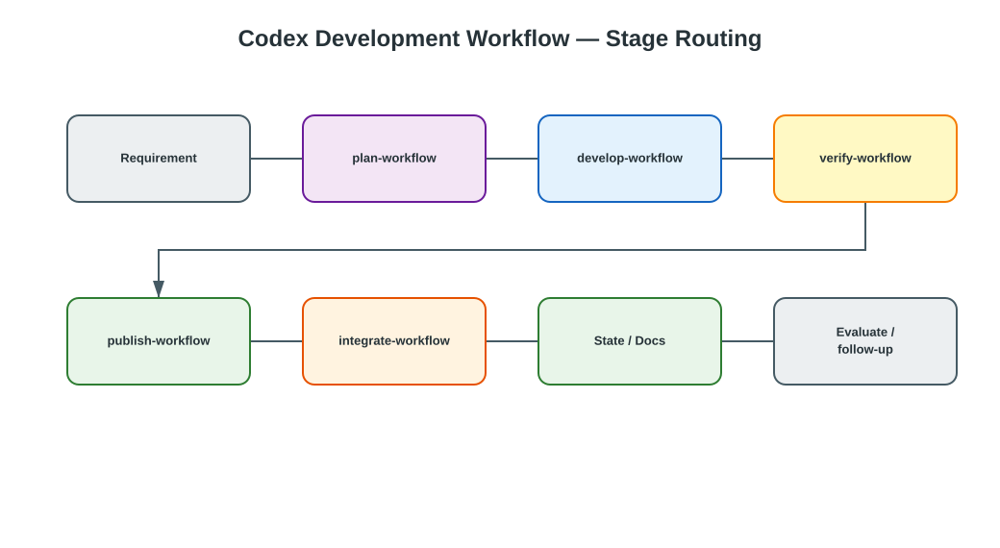
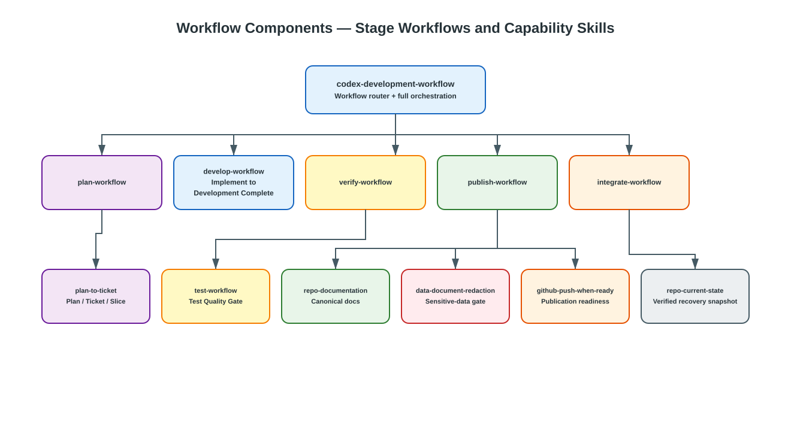
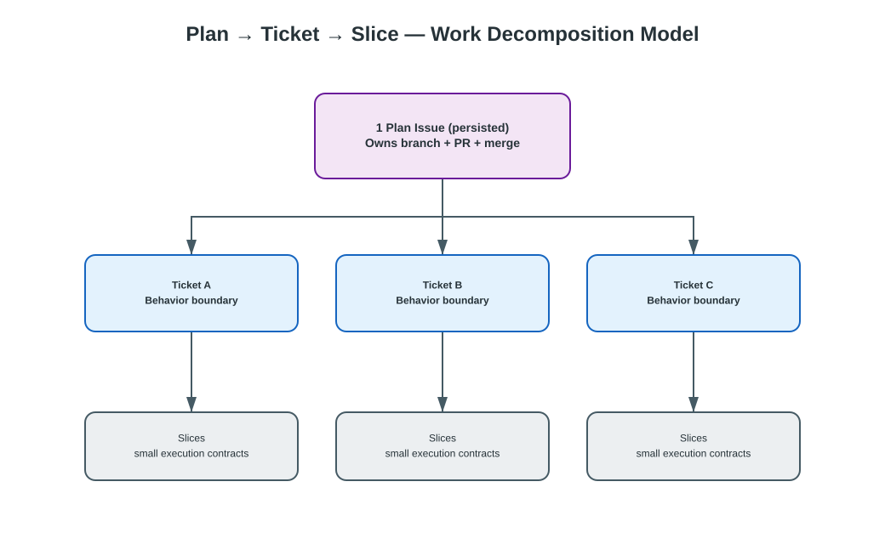
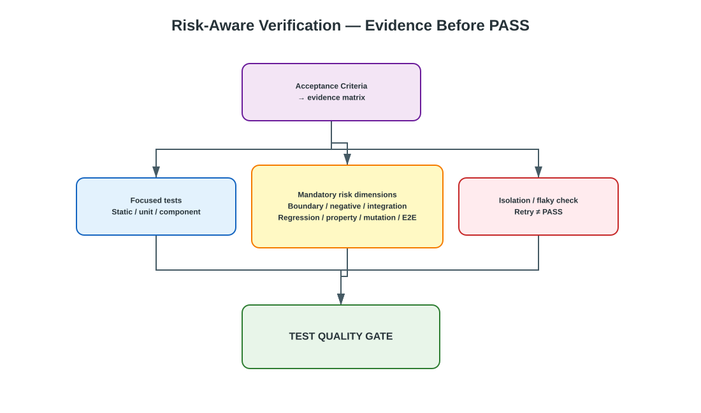

# Codex Development Workflow

A main-agent-led development workflow for Codex and Claude Code with a fixed
delivery lifecycle and adaptive multi-agent execution, plus post-delivery
process evaluation, bounded self-improvement, and all required specialist
skills managed in this repository.

## At a glance



Editable source: [`workflow-overview.drawio`](docs/diagrams/drawio/workflow-overview.drawio) ·
Detailed diagrams-as-code: [`architecture.puml`](docs/diagrams/architecture.puml)

Core invariants:

- work is routed to the stage workflow that owns it — `plan-workflow`,
  `develop-workflow`, `verify-workflow`, `publish-workflow`, or
  `integrate-workflow` — instead of one fixed chain for every request;
- a persisted **Plan Issue** owns one implementation branch, one PR, and one
  merge for all of its child **Ticket Issues**;
- Tickets decompose into dependency-ordered Slices that carry acceptance and
  validation contracts;
- PASS requires the risk-aware **Test Quality Gate**, not merely a green focused
  test run;
- documentation impact, applicable redaction, publication, merge cleanup, and
  post-merge state reconciliation remain explicit stages.


An external deployment handoff is outside this repository's workflow and does
not invoke a bundled deployment Skill. When separately authorized, the Plan
owner hands the target project's release owner the immutable artifact and
source commit, target environment and authorization, and the documented
deployment, health-check, and rollback instructions. The external release
owner performs and verifies the rollout or rollback. Completion evidence is
the external release result or incident link recorded with the delivery.

The macro workflow controls architecture and scope. A requirement that is
complex, must survive a session boundary, or is explicitly requested as a
persisted plan is recorded as one GitHub Issue Plan with one or more child
Ticket Issues before branch work starts, so a single-behavior requirement is one
Plan with one Ticket and one implicit Slice while larger requirements add
Tickets and Slices under that Plan. A persisted Plan owns the one branch, PR,
and merge. All Tickets and Slices share that branch; Ticket dependencies remain
separate from Slice dependencies, and the PR head and base must match the Plan
metadata.
Verification breadth varies with risk, and published work follows one path:
Docs, Code, Tests, Config, Refactor, Bugfix, Feature, Dependency, and CI/CD
changes all use the branch, commit, push, PR, and merge path once they are
published. Feature, Bug, Refactor, and Docs are profiles of the stage workflows,
not separate workflows. The macro stage order and gates stay fixed; inside the
current stage, the main agent chooses the smallest useful execution wave and may
run dependency-ready, non-overlapping work concurrently.

After delivery, the main agent performs one lightweight workflow evaluation.
It looks for reusable evidence such as avoidable rework, weak assumptions,
unnecessary context loading, disproportionate validation, repeated manual work,
or unclear workflow instructions. It records one highest-value improvement at
most. A safe, low-risk improvement may start automatically as one separate
follow-up change through the same branch/PR lifecycle; broad policy,
security, permission, release, or scope changes are reported instead of
self-applied. The follow-up cannot recursively create another automatic
self-improvement change.

Verification is bounded by an explicit level (`minimal`, `focused`,
`regression`, or `full`), but PASS is controlled by a risk-aware Test
Quality Gate. The default is focused validation; each acceptance criterion maps
to executed evidence, and applicable boundary, negative, integration,
regression, property/fuzz, mutation, browser, or isolation dimensions must pass
or be explicitly N/A with reason. Coverage remains diagnostic rather than a
quality target, and an unexplained flaky FAIL cannot become PASS through retry.
The main agent owns requirements, architecture, decomposition, adaptive
execution-wave scheduling, integration, evaluation, and final judgment.
Exploration, Slice implementation, and verification evidence may be delegated
when useful; the actual agent topology is chosen dynamically for each wave.

## Adaptive multi-agent execution

The workflow uses a **fixed control plane / adaptive execution plane** model.

- The fixed control plane is `plan -> develop -> verify -> publish -> integrate`
  with the existing branch, Test Quality Gate, redaction, PR, and merge
  boundaries unchanged.
- The adaptive execution plane is selected by the main agent at runtime. It
  decides whether delegation helps, which dependency-ready Slices can run in
  parallel, how many subagents are useful, and which available agent best
  matches each bounded task.
- The configured concurrency is a ceiling, not a target. A wave may use zero,
  one, or several subagents.
- The ready set is recomputed after each material result, failure, dependency
  change, or integration step. The Plan is never pre-assigned wholesale to
  agents.
- Publication, merge, stage-gate decisions, and final judgment remain with the
  main agent.

Codex reads `.codex/config.toml`, may use its built-in subagents, and may also
use project-defined agents under `.codex/agents/` when present. Claude Code may
use its built-in agents and project-defined agents under `.claude/agents/`.
The shared scheduling and safety rules live in
[`AGENTS.md`](AGENTS.md#multi-agent-delegation).

## Workflow composition examples

Stage workflows are composable. Use only the stages needed for the current
request, while preserving stage ownership and the existing gates. A partial
workflow stops when its requested stage is complete; it does not implicitly
continue into publication or merge.

### 1. Planning only

Use when the requirement needs architecture, decomposition, or a persisted Plan
but no repository change is requested yet.

```text
Requirement
  -> plan-workflow
  -> Plan / Tickets / Slices
  -> stop
```

Example request:

```text
Plan how to add multi-tenant routing. Do not modify code yet.
```

### 2. Implement only from an existing plan

Use when executable Tickets or Slices already exist and the request is only to
make the repository changes.

```text
Existing Slice
  -> develop-workflow
  -> Development Complete
  -> stop
```

Codex may execute the Slice itself or dynamically schedule independent ready
Slices across subagents. It still stops before delivery verification and
publication.

### 3. Implement and verify

Use for a local feature or bug-fix cycle where implementation and evidence are
needed, but no commit or PR is requested.

```text
develop-workflow
  -> verify-workflow
  -> PASS | FAIL | BLOCKED
  -> stop
```

A failed verification returns to development for the affected Slice rather than
advancing to publication.

### 4. Verify only

Use when code already exists and only acceptance, regression, or branch evidence
is required.

```text
Existing change
  -> verify-workflow
  -> Test Quality Gate
  -> PASS | FAIL | BLOCKED
  -> stop
```

Independent checks may run concurrently, but the main agent owns the final
verification conclusion.

### 5. Verify and publish

Use when implementation is already complete and the goal is to prove the change
and prepare it for review.

```text
Existing change
  -> verify-workflow
  -> publish-workflow
  -> documentation impact
  -> redaction when applicable
  -> commit
  -> push
  -> PR ready
  -> stop
```

This combination never merges the pull request.

### 6. Publish only

Use when the user explicitly asks to commit, push, or prepare a PR for a change
that already has sufficient verification evidence.

```text
Verified change
  -> publish-workflow
  -> PR ready
  -> stop
```

Publication still keeps documentation, redaction, branch, and PR gates intact.

### 7. Integrate only

Use when a PR is already ready and the remaining request is merge, cleanup, and
state reconciliation.

```text
Ready PR
  -> integrate-workflow
  -> merge once
  -> delete source branch
  -> update default branch
  -> close Plan / Tickets
  -> reconcile State / Docs
  -> stop
```

### 8. Full end-to-end delivery

Use only when the user explicitly authorizes complete delivery.

```text
Requirement
  -> plan-workflow
  -> develop-workflow
  -> verify-workflow
  -> publish-workflow
  -> integrate-workflow
  -> workflow evaluation
```

The macro sequence is fixed, while execution inside eligible stages stays
adaptive:

```text
ready Slices
  -> Codex chooses self / delegate / parallel wave
  -> integrate results
  -> recompute ready set
  -> continue current stage
```

### 9. Parallel implementation inside one fixed workflow

For a Plan with independent Slices:

```text
Plan
  |
  +-- Slice A: API --------> Worker / Main ---+
  +-- Slice B: UI ---------> Worker / Main ---+--> integrate wave
  +-- Slice C: docs -------> Worker / Main ---+
                                                |
                                                v
                                         verify-workflow
```

Codex decides the actual topology at runtime. If Slice A and Slice B touch the
same interface, schema, migration, shared configuration, or files, they stay
sequential even when concurrency is available.

### Composition rule

Think of the system as:

```text
Fixed stage contracts
        +
Composable requested stages
        +
Adaptive execution inside the active stage
```

Stages answer **what must happen and where the workflow stops**. The main Codex
agent decides **how ready work is executed** without changing stage ownership or
bypassing quality gates.

## Architecture

The repository keeps two complementary diagram layers:

- **Draw.io** for polished, editable, human-facing overview views.
- **PlantUML** for detailed diagrams-as-code that are easy to diff and regenerate.

### Components



Editable source: [`components-overview.drawio`](docs/diagrams/drawio/components-overview.drawio) ·
Detailed source: [`components.puml`](docs/diagrams/components.puml)

### Work decomposition



Editable source: [`plan-ticket-slice.drawio`](docs/diagrams/drawio/plan-ticket-slice.drawio)

### Verification



Editable source: [`test-quality-gate.drawio`](docs/diagrams/drawio/test-quality-gate.drawio) ·
Detailed test flow: [`test-workflow-flow.puml`](docs/skills/test-workflow/diagrams/test-workflow-flow.puml)

See the [architecture overview](docs/architecture/overview.md) for the detailed
lifecycle, Ticket/Slice loops, documentation governance, publication boundaries,
state recovery, and installation flow.

## Install from this repository

```bash
git clone https://github.com/i-zrhe2016/codex-development-workflow.git
cd codex-development-workflow
bash scripts/install-all.sh
```

The installer copies the local bundles under `skills/`; it does not clone
specialist repositories. Select the host with `--target codex` (the default) or
`--target claude`, and repeat that target when updating — `--update` without
`--target` always updates the Codex destination. See the
[installation and update guide](docs/deployment/installation.md) for the
destination of each target.

Update existing installations:

```bash
bash scripts/install-all.sh --update
```

Restart the host after installation so it discovers the new skill directories.

## Installed skills

- `codex-development-workflow`
- `plan-workflow`
- `develop-workflow`
- `verify-workflow`
- `publish-workflow`
- `integrate-workflow`
- `plan-to-ticket`
- `test-workflow`
- `repo-current-state`
- `repo-documentation`
- `data-document-redaction`
- `github-push-when-ready`

`plan-to-ticket` persists one Plan and its child Tickets to GitHub Issues when
the work is complex, must survive a session boundary, or the user asks for a
persisted plan. For a persisted plan, GitHub Issues are the sole durable
Plan/Ticket authority; chat output and `Repo_Current_State.md` provide links and
recovery context, not a parallel backlog. A Plan may contain one or more
Tickets, and its branch/PR/merge gate applies once per Plan, never once per
Ticket.

## Skill documentation

Runtime skill sources live under `skills/` and are installed by
[`scripts/install-all.sh`](scripts/install-all.sh). Specialist documentation
is grouped under
[`docs/skills/`](docs/skills/); operational references remain beside the
relevant bundle.

| Skill | Runtime source | Documentation |
|---|---|---|
| `codex-development-workflow` | [`SKILL.md`](SKILL.md) | [Workflow usage](docs/workflow/usage.md) · [Architecture](docs/architecture/overview.md) |
| `plan-workflow` | [`skills/plan-workflow/`](skills/plan-workflow/) | [Workflow usage](docs/workflow/usage.md) · [Architecture](docs/architecture/overview.md) |
| `develop-workflow` | [`skills/develop-workflow/`](skills/develop-workflow/) | [Workflow usage](docs/workflow/usage.md) · [Architecture](docs/architecture/overview.md) |
| `verify-workflow` | [`skills/verify-workflow/`](skills/verify-workflow/) | [Workflow usage](docs/workflow/usage.md) · [Architecture](docs/architecture/overview.md) |
| `publish-workflow` | [`skills/publish-workflow/`](skills/publish-workflow/) | [Workflow usage](docs/workflow/usage.md) · [Architecture](docs/architecture/overview.md) |
| `integrate-workflow` | [`skills/integrate-workflow/`](skills/integrate-workflow/) | [Workflow usage](docs/workflow/usage.md) · [Architecture](docs/architecture/overview.md) |
| `plan-to-ticket` | [`skills/plan-to-ticket/`](skills/plan-to-ticket/) | [Skill README](docs/skills/plan-to-ticket/README.md) · [Architecture](docs/skills/plan-to-ticket/architecture.md) |
| `test-workflow` | [`skills/test-workflow/`](skills/test-workflow/) | [Skill README](docs/skills/test-workflow/README.md) · [Architecture](docs/skills/test-workflow/architecture.md) · [Usage](docs/skills/test-workflow/usage.md) |
| `repo-current-state` | [`skills/repo-current-state/`](skills/repo-current-state/) | [Skill README](docs/skills/repo-current-state/README.md) · [Architecture](docs/skills/repo-current-state/architecture.md) |
| `repo-documentation` | [`skills/repo-documentation/`](skills/repo-documentation/) | [Skill documentation](docs/skills/repo-documentation/README.md) |
| `data-document-redaction` | [`skills/data-document-redaction/`](skills/data-document-redaction/) | [Skill documentation](docs/skills/data-document-redaction/README.md) |
| `github-push-when-ready` | [`skills/github-push-when-ready/`](skills/github-push-when-ready/) | [Skill documentation](docs/skills/github-push-when-ready/README.md) |


## Documentation

- [Architecture overview](docs/architecture/overview.md)
- [Installation and update guide](docs/deployment/installation.md)
- [Workflow usage guide](docs/workflow/usage.md)
- [Redaction workflow](docs/workflow/redaction.md)
- [Workflow process evaluation](docs/workflow/process-evaluation.md)
- [Managed skill source map](references/skill-map.md)
- [Repository current state](docs/Repo_Current_State.md)
- [Editable Draw.io overview diagrams](docs/diagrams/drawio/README.md)
