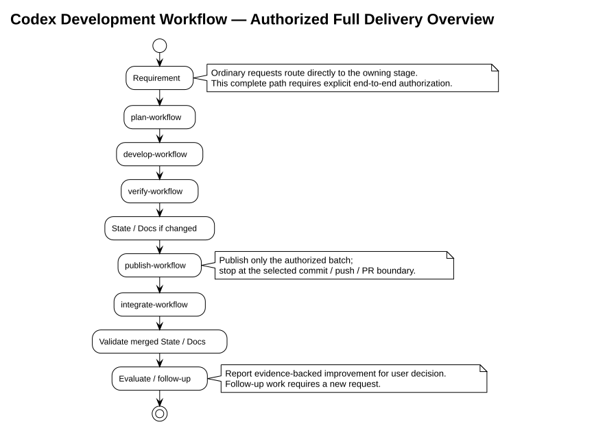

# Codex Development Workflow

A main-agent-led development workflow for Codex and Claude Code with a fixed
delivery lifecycle and adaptive multi-agent execution, plus post-delivery
process evaluation, bounded self-improvement, and all required specialist
skills managed in this repository.

## At a glance



Source: [`workflow-overview.puml`](docs/diagrams/workflow-overview.puml) ·
Detailed diagrams-as-code: [`architecture.puml`](docs/architecture/diagrams/architecture.puml)

Core invariants:

- work is routed to the stage workflow that owns it — `plan-workflow`,
  `develop-workflow`, `verify-workflow`, `publish-workflow`, or
  `integrate-workflow` — instead of one fixed chain for every request;
- a **Plan** is an explicitly scoped delivery batch, which may include multiple
  independent functionalities; a persisted **Plan Issue** owns one implementation
  branch, one PR, and one merge for all of its child **Ticket Issues**;
- Tickets decompose into dependency-ordered Slices that carry acceptance and
  validation contracts;
- PASS requires the risk-aware **Test Quality Gate**, not merely a green focused
  test run;
- documentation impact, applicable state refresh, redaction, publication, and
  merge cleanup remain explicit gates; `Repo_Current_State.md` changes travel
  with the PR they describe.


An external deployment handoff is outside this repository's workflow and does
not invoke a bundled deployment Skill. When separately authorized, the Plan
owner hands the target project's release owner the immutable artifact and
source commit, target environment and authorization, and the documented
deployment, health-check, and rollback instructions. The external release
owner performs and verifies the rollout or rollback. Completion evidence is
the external release result or incident link recorded with the delivery.

The macro workflow controls architecture and scope. A delivery batch that is
complex, must survive a session boundary, or is explicitly requested as a
persisted plan is recorded as one GitHub Issue Plan with one or more child
Ticket Issues before branch work starts. A single behavior uses one Ticket and
one implicit Slice; multiple planned functionalities retain their behavior
Tickets under one Plan. See the [Plan scope contract](skills/plan-to-ticket/SKILL.md#scope-and-sizing)
and [batch publication rules](skills/github-push-when-ready/SKILL.md#readiness-and-boundaries)
for shared commit/PR scope and verification. A persisted Plan owns the one branch, PR,
and merge. All Tickets and Slices share that branch; Ticket dependencies remain
separate from Slice dependencies, and the PR head and base must match the Plan
metadata. New user-requested functionality joins the same unmerged Plan as a
new Ticket after its scope, index, dependencies and validation are updated;
after merge it uses a new Plan. Local verified functionality is a normal
stopping point. The user decides commit, push, PR creation/update and merge
timing and scope; see [workflow usage](docs/workflow/usage.md#publication-decisions)
for action boundaries and open-PR expansion.
Verification breadth varies with risk. When the user elects final delivery:
Docs, Code, Tests, Config, Refactor, Bugfix, Feature, Dependency, and CI/CD
changes all use the branch, commit, push, PR, and merge path. Selected local,
commit-only and push-only requests stop at their authorized boundary. Feature, Bug, Refactor, and Docs are profiles of the stage workflows,
not separate workflows. The macro stage order and gates stay fixed; inside the
current stage, the main agent chooses the smallest useful execution wave and may
run dependency-ready, non-overlapping work concurrently.

After delivery, the main agent performs one lightweight workflow evaluation.
It looks for reusable evidence such as avoidable rework, weak assumptions,
unnecessary context loading, disproportionate validation, repeated manual work,
or unclear workflow instructions. It records one highest-value improvement at
most, for the user to choose. Evaluation grants no implementation or
publication authority; a requested follow-up after merge starts a new Plan
and runs only its authorized stages/actions, with the same gates.

Verification is bounded by an explicit level (`minimal`, `focused`,
`regression`, or `full`), but PASS is controlled by a risk-aware Test
Quality Gate. The default is focused validation; each acceptance criterion maps
to executed evidence, and applicable boundary, negative, integration,
AuthN/AuthZ, regression, property/fuzz, mutation, browser, or isolation
dimensions must pass or be explicitly N/A with reason. Authentication and
authorization are proven separately when relevant, denied operations must show
protected side-effect absence, and tests must be falsifiable rather than relying
on mock-called, value-exists, no-exception or status-only assertions unless that
is the contract. Coverage remains diagnostic rather than a quality target, and
an unexplained flaky FAIL cannot become PASS through retry.
Verification also follows Same-Surface Verification: prove runtime identity with
a doctor/health signal, drive the intended artifact/instance/surface, report
reproducible evidence, and treat unprovable artifact/instance/surface identity
as `BLOCKED`. Target projects may keep verification profiles or feature maps in
`docs/verification/`; that is repository-specific knowledge, not a new workflow
Skill.
The main agent owns requirements, architecture, decomposition, scheduling,
integration, evaluation, and final judgment. It directly dispatches a fresh
owner for each Ticket; that owner retains context across dependency-ordered
Slices, then a fresh verifier checks all Ticket scenarios. Final Plan
acceptance normally uses a separate fresh verifier. One new Sol/high verifier
may cover both gates only for a one-Ticket Plan with identical full scope,
artifact/version, configuration, and deployment surface. Optional
independent-module helpers may work in parallel only with fixed interfaces,
isolated workspaces, and independent verification. Workers never dispatch
workers. The root [`SKILL.md`](SKILL.md#codex-worker-model-routing) owns model
and effort defaults; [`AGENTS.md`](AGENTS.md#multi-agent-delegation) owns the
execution contract, capacity, and scheduling.

## Adaptive multi-agent execution

The main agent dispatches fresh Ticket owners and independent verifiers directly;
all workers are leaves and never spawn agents. Owners retain context across
Slices and local repairs. Dependent Tickets may be prepared read-only, while
writes wait for prerequisite acceptance. Optional module helpers require
independent modules, fixed interfaces, non-overlapping ownership, and isolated
workspaces or returned patches. Admission uses actual host capacity: main plus
one worker requires two slots, and work queues when capacity is exhausted; no
project concurrency or lifetime quota applies. The canonical
[`AGENTS.md` policy](AGENTS.md#multi-agent-delegation) defines model routing,
repair escalation, exact-scope verification reuse, checkpoints, and recovery.
Installed root/develop/verify/test Skills retain minimum runtime rules because
AGENTS.md is not installed.

## Workflow composition examples

Stage workflows are composable. Use only the stages needed for the current
request, while preserving stage ownership and the existing gates. A partial
workflow stops when its requested stage is complete; it does not implicitly
continue into publication or merge.

### 1. Planning only

Use when the requirement needs architecture, decomposition, or a persisted Plan
but no repository change is requested yet.

```text
Requirement
  -> plan-workflow
  -> Plan / Tickets / Slices
  -> stop
```

Example request:

```text
Plan how to add multi-tenant routing. Do not modify code yet.
```

### 2. Implement only from an existing plan

Use when executable Tickets or Slices already exist and the request is only to
make the repository changes.

```text
Existing Ticket / Slices
  -> develop-workflow: main dispatches fresh Ticket owner
  -> same owner implements dependency-ready Slices + local validation
  -> Development Complete
  -> stop
```

The main agent dispatches the Ticket owner, who stops after local validation,
before independent Ticket acceptance verification or publication.

### 3. Implement and verify

Use for a local feature or bug-fix cycle where implementation and evidence are
needed, but no commit or PR is requested.

```text
main -> fresh Ticket owner across Slices
  -> verify-workflow: separate fresh verifier for all Ticket scenarios
  -> PASS | FAIL | BLOCKED
  -> stop
```

A failed verification returns fixes to implementation; a new verifier then
rechecks the affected functionality with prior failure evidence retained.

### 4. Verify only

Use when code already exists and only acceptance, regression, or branch evidence
is required.

```text
Existing change
  -> verify-workflow
  -> Test Quality Gate
  -> PASS | FAIL | BLOCKED
  -> stop
```

A fresh independent Ticket verifier runs all functionality scenarios; the main
agent owns the final gate decision. If this verification is for final
Plan/branch/PR acceptance, one fresh independent verifier checks the whole
current scope before readiness can pass.

### 5. Verify and publish

Use when implementation is already complete and the goal is to prove the change
and prepare it for review.

```text
Existing change
  -> verify-workflow
  -> publish-workflow
  -> documentation impact
  -> redaction when applicable
  -> commit
  -> push
  -> PR ready
  -> stop
```

This combination never merges the pull request.

### 6. Publish only

Use when the user explicitly asks to commit, push, or prepare a PR for a change
that already has sufficient verification evidence.

```text
Verified change
  -> publish-workflow
  -> requested commit | push | create/update PR
  -> stop at that boundary
```

Commit-only creates no push or PR; push-only creates no commit or PR.
Local verification grants no publication authority. Publication keeps
documentation, redaction, branch, identity and PR gates intact; merge requires
its own authorization or explicit full delivery scope.

### 7. Integrate only

Use when a PR is already ready and the remaining request is merge, cleanup, and
state reconciliation.

```text
Ready PR
  -> integrate-workflow
  -> merge once
  -> delete source branch
  -> update default branch
  -> validate PR-included State / Docs
  -> close Plan / Tickets
  -> stop
```

### 8. Full end-to-end delivery

Use only when the user explicitly authorizes complete delivery.

```text
Requirement
  -> plan-workflow
  -> develop-workflow
  -> verify-workflow
  -> publish-workflow
  -> integrate-workflow
  -> workflow evaluation
```

The macro sequence is fixed, while execution inside eligible stages stays
adaptive:

```text
ready Tickets
  -> main dispatches fresh Ticket owners within actual host capacity
  -> each owner implements its Slices and reports Development Complete
  -> integrate results
  -> recompute ready set
  -> continue current stage
```

### 9. Parallel implementation inside one fixed workflow

For a Plan with independent Tickets and disjoint write/test-state ownership:

```text
Main agent
  +-- fresh Ticket owner A -> dependency-ordered Slices -> fresh verifier A
  +-- fresh Ticket owner B -> dependency-ordered Slices -> fresh verifier B
  -> integrate evidence and decide gates
  -> final Plan acceptance: separate fresh verifier unless exact-scope coalescing applies
```

Ticket concurrency is allowed only when scopes, interfaces, files, configuration,
and shared test state do not conflict; parallel writers need isolated workspaces
or returned patches. Every active role counts against actual host capacity.
Read-only preparation may proceed across dependencies, but dependent writes wait
for prerequisite independent PASS. See the
[scheduling policy](AGENTS.md#multi-agent-delegation).

### Composition rule

Think of the system as:

```text
Fixed stage contracts
        +
Composable requested stages
        +
Adaptive execution inside the active stage
```

Stages answer **what must happen and where the workflow stops**. The main Codex
agent decides **how ready work is executed** without changing stage ownership or
bypassing quality gates.

## Architecture

All repository diagrams use **PlantUML** sources and generated SVG images.
Overview and detailed views use the same format for review and regeneration.

### Components


Source: [`components-overview.puml`](docs/diagrams/components-overview.puml) ·
Detailed source: [`components.puml`](docs/architecture/diagrams/components.puml)

### Work decomposition


Source: [`plan-ticket-slice.puml`](docs/diagrams/plan-ticket-slice.puml)

### Verification


Source: [`test-quality-gate.puml`](docs/diagrams/test-quality-gate.puml) ·
Detailed test flow: [`test-workflow-flow.puml`](docs/skills/test-workflow/diagrams/test-workflow-flow.puml)

See the [architecture overview](docs/architecture/overview.md) for the detailed
lifecycle, Ticket/Slice loops, documentation governance, publication boundaries,
state recovery, and installation flow.

## Install from this repository

```bash
git clone https://github.com/i-zrhe2016/codex-development-workflow.git
cd codex-development-workflow
bash scripts/install-all.sh
```

The installer copies the local bundles under `skills/`; it does not clone
specialist repositories. Select the host with `--target codex` (the default) or
`--target claude`, and repeat that target when updating — `--update` without
`--target` always updates the Codex destination. See the
[installation and update guide](docs/deployment/installation.md) for the
destination of each target.

Update existing installations:

```bash
bash scripts/install-all.sh --update
```

Restart the host after installation so it discovers the new skill directories.

## Installed skills

- `codex-development-workflow`
- `plan-workflow`
- `develop-workflow`
- `verify-workflow`
- `publish-workflow`
- `integrate-workflow`
- `plan-to-ticket`
- `test-workflow`
- `skill-eval`
- `plantuml`
- `repo-current-state`
- `repo-documentation`
- `data-document-redaction`
- `github-push-when-ready`

`plan-to-ticket` persists one Plan and its child Tickets to GitHub Issues when
the work is complex, must survive a session boundary, or the user asks for a
persisted plan. For a persisted plan, GitHub Issues are the sole durable
Plan/Ticket authority; chat output and `Repo_Current_State.md` provide links and
recovery context, not a parallel backlog. A Plan may contain one or more
Tickets, and its branch/PR/merge gate applies once per Plan, never once per
Ticket.

## Skill documentation

Runtime skill sources live under `skills/` and are installed by
[`scripts/install-all.sh`](scripts/install-all.sh). Specialist documentation
is grouped under
[`docs/skills/`](docs/skills/); operational references remain beside the
relevant bundle.

| Skill | Runtime source | Documentation |
|---|---|---|
| `codex-development-workflow` | [`SKILL.md`](SKILL.md) | [Workflow usage](docs/workflow/usage.md) · [Architecture](docs/architecture/overview.md) |
| `plan-workflow` | [`skills/plan-workflow/`](skills/plan-workflow/) | [Workflow usage](docs/workflow/usage.md) · [Architecture](docs/architecture/overview.md) |
| `develop-workflow` | [`skills/develop-workflow/`](skills/develop-workflow/) | [Workflow usage](docs/workflow/usage.md) · [Architecture](docs/architecture/overview.md) |
| `verify-workflow` | [`skills/verify-workflow/`](skills/verify-workflow/) | [Workflow usage](docs/workflow/usage.md) · [Architecture](docs/architecture/overview.md) |
| `publish-workflow` | [`skills/publish-workflow/`](skills/publish-workflow/) | [Workflow usage](docs/workflow/usage.md) · [Architecture](docs/architecture/overview.md) |
| `integrate-workflow` | [`skills/integrate-workflow/`](skills/integrate-workflow/) | [Workflow usage](docs/workflow/usage.md) · [Architecture](docs/architecture/overview.md) |
| `plan-to-ticket` | [`skills/plan-to-ticket/`](skills/plan-to-ticket/) | [Skill README](docs/skills/plan-to-ticket/README.md) · [Architecture](docs/skills/plan-to-ticket/architecture.md) |
| `test-workflow` | [`skills/test-workflow/`](skills/test-workflow/) | [Skill README](docs/skills/test-workflow/README.md) · [Architecture](docs/skills/test-workflow/architecture.md) · [Usage](docs/skills/test-workflow/usage.md) |
| `skill-eval` | [`skills/skill-eval/`](skills/skill-eval/) | — |
| `plantuml` | [`skills/plantuml/`](skills/plantuml/) | [Skill documentation](docs/skills/plantuml/README.md) |
| `repo-current-state` | [`skills/repo-current-state/`](skills/repo-current-state/) | [Skill README](docs/skills/repo-current-state/README.md) · [Architecture](docs/skills/repo-current-state/architecture.md) |
| `repo-documentation` | [`skills/repo-documentation/`](skills/repo-documentation/) | [Skill documentation](docs/skills/repo-documentation/README.md) |
| `data-document-redaction` | [`skills/data-document-redaction/`](skills/data-document-redaction/) | [Skill documentation](docs/skills/data-document-redaction/README.md) |
| `github-push-when-ready` | [`skills/github-push-when-ready/`](skills/github-push-when-ready/) | [Skill documentation](docs/skills/github-push-when-ready/README.md) |


## Documentation

- [Architecture overview](docs/architecture/overview.md)
- [Installation and update guide](docs/deployment/installation.md)
- [Workflow usage guide](docs/workflow/usage.md)
- [Local package validation](docs/workflow/usage.md#local-package-validation)
- [Redaction workflow](docs/workflow/redaction.md)
- [Workflow process evaluation](docs/workflow/process-evaluation.md)
- [Managed skill source map](references/skill-map.md)
- [Repository current state](docs/Repo_Current_State.md)
- [PlantUML overview diagrams](docs/diagrams/README.md)
