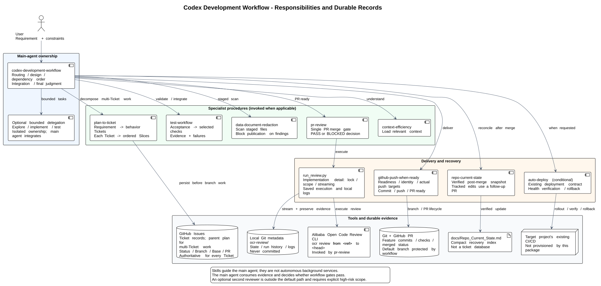
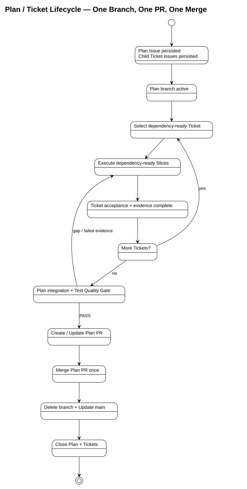
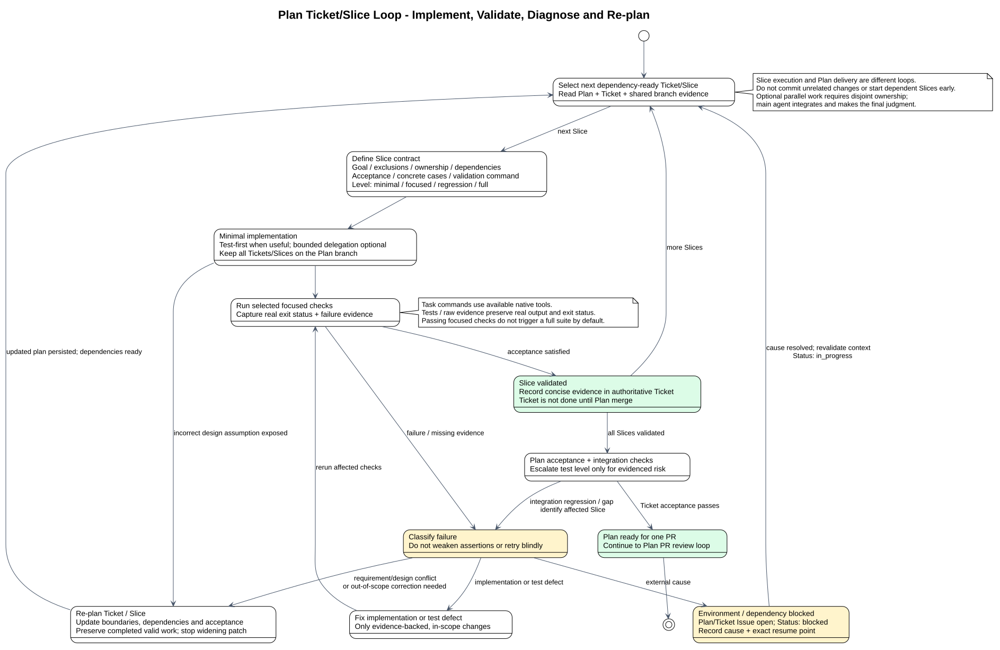
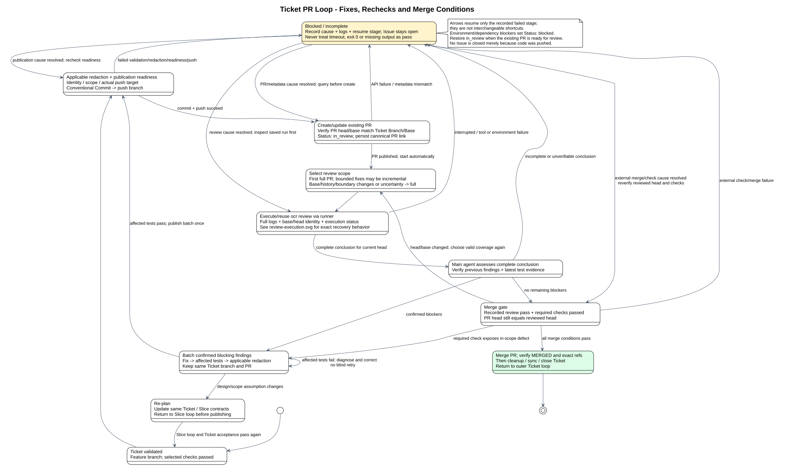
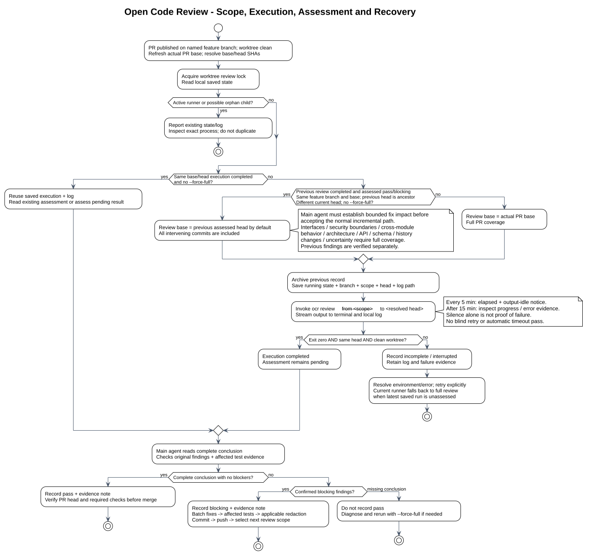

# Architecture Overview

## Scope

This repository packages a main-agent-led Codex development-workflow
orchestrator with optional bounded delegation and its specialist skills. The
orchestrator owns stage routing and quality gates; specialist procedures
remain inside their own `SKILL.md` files.

## Components

| Component | Responsibility |
|---|---|
| `codex-development-workflow` | Coordinates the single Requirement-to-PR-to-Merge lifecycle, Plan/Ticket/Slice decomposition, bounded verification, and delivery gates. |
| Delegation | Optional bounded implementation work after branch creation; it never creates a second delivery path or bypasses the PR gate. |
| `explorer` / `worker` | Built-in read-heavy exploration and execution roles used only for delegated, bounded tasks. |
| `.codex/agents/reviewer.toml` | Optional project-scoped supplemental read-only reviewer; it cannot replace `codex review`. |
| `.codex/config.toml` | Enables subagents and caps spawned-agent concurrency at three for this project. |
| `plan-to-ticket` | Splits complex requirements into behavior Tickets, decomposes each Ticket into dependency-ordered Slices with explicit scope and acceptance criteria, then persists the parent plan and ticket Issues before branch work. |
| GitHub Issues connector | Stores the durable plan/ticket records and their current status, dependency, branch, base, and PR metadata. |
| `test-workflow` | Runs the selected verification level and reports bounded evidence. |
| `repo-current-state` | Maintains the compact, verified recovery point after merge, branch cleanup, and default-branch synchronization. |
| `context-efficiency` | Optional context-loading aid for large or unfamiliar repositories; not a workflow stage. |
| `auto-deploy` | Discovers the deployment contract, gates automatic releases, verifies health, and coordinates safe rollback. |
| `docs/skills/` | Specialist README, architecture, usage, and supporting documentation. |
| `scripts/install-all.sh` | Installs the root orchestrator and local specialist bundles. |
| `references/skill-map.md` | Maps each managed bundle to its local source and Codex destination. |
| `data-document-redaction` | Scans the complete artifact set before commit and again after blocking review fixes when applicable. |
| `github-push-when-ready` | Guards feature-branch creation/publication, Commit, Push, PR, Merge, and source-branch cleanup. |

The main agent centrally owns requirements, architecture, planning, dependency
ordering, integration, and final judgment. The optional Delegation Gate may
route independent exploration, testing, isolated implementation, or review to
bounded workers. Dependent or overlapping work remains sequential, and the
main agent must not duplicate active delegated work.

## Development process

### Component responsibilities and records



Editable source: [`components.puml`](../diagrams/components.puml). Skills are
main-agent procedures, not independently running services. Solid arrows show
invocation or record ownership; the main agent retains integration and gate decisions.

### End-to-end lifecycle


Editable source: [`architecture.puml`](../diagrams/architecture.puml).

### Macro stages

```text
Requirement
  -> Understand repo
  -> Plan
  -> Slice / Ticket if needed
  -> Create branch
  -> Implement
  -> Test
  -> Redaction scan if applicable
  -> Commit
  -> Push branch
  -> Create / Update PR
  -> Automatic Review
  -> Fix / Test / Redaction / Commit / Push / Review loop when blocked
  -> Merge PR
  -> Delete branch
  -> Update main
  -> Close Ticket
  -> Update State / Docs
  -> Deploy if needed
```

All change types—Docs, Code, Tests, Config, Refactor, Bugfix, Feature,
Dependency, and CI/CD—use the same feature-branch and PR lifecycle. Planning
depth, test level, and whether a Ticket is needed may vary, but no category may
direct-push around the PR gate. If a Ticket is used, split its Slices only after
the Ticket boundary is clear; a single-behavior change may use one Slice without
a Ticket and still follows the complete delivery path.

If `plan-to-ticket` is used, it persists the plan and Ticket Issues before the
branch is created. Each Slice loads only the context needed for its acceptance
criteria. A wrong design assumption returns to Plan or causes a Slice split.

### Ticket-to-Slice hierarchy

The detailed Ticket lifecycle is split into three linked views so each return
edge has a clear scope and exit condition:



Source: [`ticket-lifecycle.puml`](../diagrams/ticket-lifecycle.puml).



Source: [`ticket-slice-loop.puml`](../diagrams/ticket-slice-loop.puml).



Source: [`ticket-review-loop.puml`](../diagrams/ticket-review-loop.puml).

Dependency waits resume only after fresh evidence; a failed Slice returns to
diagnosis and affected validation, while a design conflict returns to planning.
PR findings are fixed in one batch on the same branch and republished before
review. Recovery returns to the recorded failed stage, never a later gate.
Only a verified merge permits `done` and Issue closure. The outer loop then
selects the next Ticket against the synchronized base. `planned`, `in_progress`,
`blocked`, and `in_review` remain open states; `Status` is Ticket Issue metadata,
not a claim that GitHub provides these workflow states automatically.

A Ticket is an independently reviewable behavior or capability boundary. A
Slice is an execution-ready unit within a Ticket, with its own scope,
dependencies, acceptance criteria, test strategy, test level, test cases, and
validation command. For a large or multi-behavior request, establish the
Ticket boundaries first, then split each Ticket into its dependency-ordered
Slices. All Slices for one Ticket share its implementation branch; Ticket
dependencies control branch readiness, while Slice dependencies control work
order within the branch. Tiny work may remain one implicit Slice without a
Ticket.

### Persistent ticket authority

GitHub Issues are the sole durable authority for plans and tickets created by
`plan-to-ticket`. A parent plan Issue holds the overall plan and links to one
Issue per behavior ticket. Each ticket Issue retains its goal, scope,
dependencies, acceptance criteria, validation, and `Status`, `Branch`, `Base`,
and `PR` metadata. The workflow blocks when required Issue reads or writes
fail; it does not create a local Markdown mirror or treat chat output as
completion.

`Repo_Current_State.md` remains a compact recovery pointer to the active Issue,
not a backlog or second ticket database.

### Ticket branches

Every change owns a feature branch created or resumed before editing. Ticketed
work uses one branch named `<type>/<ticket-id>-<short-description>`; a single
Slice without a Ticket uses `<type>/<short-description>`. Create branches from
the updated default branch and wait for prerequisite Tickets to merge before
branching dependent work. Parallel workers use separate Git worktrees and
branches; they never switch branches in a shared working directory. Each Ticket
Issue is the one-to-one owner of its branch: record `Branch` and `Base` before
editing, set `Status: in_progress` when work starts, and require the PR head/base
to match those fields.

### Delegation gate

Delegation is optional and may occur after branch creation during
implementation. The main agent delegates only tasks with a clear goal, scope
and exclusions, ownership boundary, dependencies, acceptance criteria,
validation, and expected result summary. Parallel write tasks must not share
files, interfaces, schemas, migrations, or configuration. Delegation never
bypasses Test, Redaction when applicable, Commit, Push, PR, Automatic Review, or
Merge. Prefer a single delegation level.

### Slice execution

```text
Acceptance criteria -> Test strategy -> Minimal change
                    -> Focused validation -> Fix / Refactor
                    -> Slice complete
```

Test-first is preferred for meaningful behavioral changes, bug fixes,
regressions, API behavior, core business logic, data processing, and high-risk
code. It is not forced for documentation, configuration, dependency updates,
styling, typo fixes, simple refactors, or exploratory work.

### Bounded verification

| Level | Purpose |
|---|---|
| `minimal` | Tiny and non-behavioral changes. |
| `focused` | Default evidence for one Slice. |
| `regression` | Bug fixes and cross-module risk. |
| `full` | High-risk or release verification. |

After the selected level passes, stop unless the acceptance criteria, failure
evidence, affected boundaries, release requirements, or the user justify an
escalation.

### Automatic Review and final gates



Editable source: [`review-execution.puml`](../diagrams/review-execution.puml).
The runner persists execution separately from the main agent's assessment.
Completed results with matching base/head can be reused. The first review is
full; explicitly selected bounded fixes can use the last assessed head. Base
changes, rewritten history, interface/security boundary changes, cross-module
behavior or uncertain impact require full review. An interrupted latest run
currently causes a full-review fallback on retry rather than reusing an older
assessment. See the [execution contract](../../skills/github-push-when-ready/references/review-execution.md).

Every change must be committed and pushed to a feature branch, then have a PR
created or updated before Automatic Review starts. Automatic Review is exactly
the built-in `codex review` command; run it immediately without waiting for user
confirmation, using the selected review range, branch boundary, and available CI
results. Batch blocking findings before Fix -> Test -> Redaction if applicable ->
Commit -> Push -> `codex review` again on the updated PR. Merge only after the
review passes. When multiple Tickets are delivered together, add broader
integration/regression checks across them in addition to each Ticket's checks.

`Understand -> Plan -> Slice/Ticket if needed -> Branch -> Implement -> Test -> Redaction if applicable -> Commit -> Push -> Create/Update PR -> Automatic Review -> Fix/Test/Redaction/Commit/Push/Review loop -> Merge -> Delete branch -> Update main -> Close Ticket -> State/Docs -> Deploy if needed`

Automatic Review remains separate from tests, diagnostics, linting, and static
analysis. The project-scoped `.codex/agents/reviewer.toml` is optional
supplemental review and cannot replace the built-in `codex review` gate; invoke
it only as an additional read-only check from an interactive Codex session.

### Project-scoped Codex configuration

`.codex/config.toml` enables subagents and limits this project to three
concurrently open spawned-agent threads, excluding the main thread.
`.codex/agents/reviewer.toml` provides an optional supplemental read-only
reviewer. The
installer copies managed skills only; these project-scoped files remain in the
checkout where Codex runs.

### Sensitive-output gate

Classify the complete output set before commit and before every sharing, export,
upload, or publication boundary. Repeat the scan after any blocking review fix
before the next commit. Include source files, documentation, logs, configs,
images, screenshots, exports, filenames, and metadata.

If no potentially sensitive surface is in scope, record the inspected scope and
skip reason. Otherwise invoke `data-document-redaction`. Only a `pass` report
advances; `needs_review` and `blocked` stop the boundary transition.

## Installation flow

1. Obtain a checkout of this repository and run `scripts/install-all.sh`.
2. The installer validates each local `SKILL.md` and copies the configured bundle into `${CODEX_HOME:-$HOME/.codex}/skills` or `--dest PATH`.
3. Existing skills are skipped unless `--update` is used.
4. Restart Codex to discover installed skills.

The installer and [`references/skill-map.md`](../../references/skill-map.md)
must remain aligned.

## Boundaries

- The orchestrator defines stages and gates; specialist skills define detailed procedures.
- Slices and Tickets are planning tools; a single-behavior request may remain one implicit Slice, but every change still uses a feature branch and PR.
- Tests provide evidence inside a Slice; Automatic Review is a mandatory PR-stage merge gate after the branch is published.
- `Repo_Current_State.md` is the recovery point, not a session transcript or full backlog.
- Redaction is conditional, not a mandatory transformation of every artifact.
- State / Docs are updated after merge, source-branch deletion, and default-branch synchronization.
- The package does not own target-project source code, application data, or deployment infrastructure.
- Specialist skills are vendored under `skills/` and updated through this repository's normal review and version-control process.
