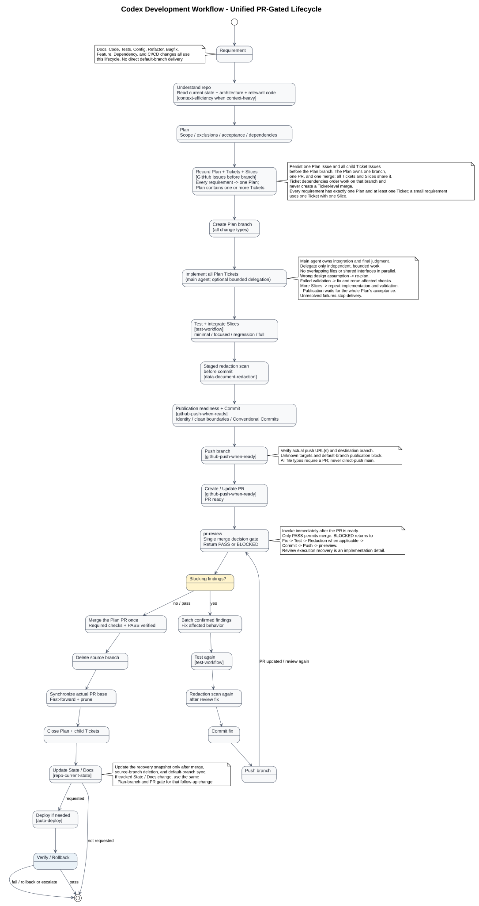

# Architecture Overview

## Scope

This repository packages a main-agent-led Codex development-workflow
orchestrator with optional bounded delegation and its specialist skills. The
orchestrator owns stage routing and quality gates; specialist procedures
remain inside their own `SKILL.md` files.

## Components

| Component | Responsibility |
|---|---|
| `codex-development-workflow` | Classifies work, coordinates Plan/Slice execution, bounded verification, review, and delivery gates. |
| Delegation Gate | Decides after Slicing whether independent, bounded work should stay with the main agent or go to built-in workers. |
| `explorer` / `worker` | Built-in read-heavy exploration and execution roles used only for delegated, bounded tasks. |
| `.codex/agents/reviewer.toml` | Project-scoped read-only reviewer for the single PR-stage review. |
| `.codex/config.toml` | Enables subagents and caps spawned-agent concurrency at three for this project. |
| `plan-to-ticket` | Produces small, dependency-ordered Slices with explicit scope and acceptance criteria, then persists the parent plan and ticket Issues before branch work. |
| GitHub Issues connector | Stores the durable plan/ticket records and their current status, dependency, branch, base, and PR metadata. |
| `test-workflow` | Runs the selected verification level and reports bounded evidence. |
| `repo-current-state` | Maintains the compact, verified recovery point for the repository. |
| `context-efficiency` | Optional context-loading aid for large or unfamiliar repositories; not a workflow stage. |
| `auto-deploy` | Discovers the deployment contract, gates automatic releases, verifies health, and coordinates safe rollback. |
| `docs/skills/` | Specialist README, architecture, usage, and supporting documentation. |
| `scripts/install-all.sh` | Installs the root orchestrator and local specialist bundles. |
| `references/skill-map.md` | Maps each managed bundle to its local source and Codex destination. |
| Redaction / publication skills | Guard sensitive outputs and commit/push boundaries. |

The main agent centrally owns requirements, architecture, planning, dependency
ordering, integration, and final judgment. The optional Delegation Gate may
route independent exploration, testing, isolated implementation, or review to
bounded workers. Dependent or overlapping work remains sequential, and the
main agent must not duplicate active delegated work.

## Development process



Editable source: [`architecture.puml`](../diagrams/architecture.puml).

### Macro stages

```text
Requirement -> Classify -> Understand -> Plan -> Slice
           -> Persist plan/tickets to GitHub Issues -> Delegate if useful
           -> Create/resume ticket branch
           -> Execute/Test -> Next Slice? -> Integration
           -> State / Docs -> Redaction -> Commit / Push -> Open PR
           -> Review -> Fix findings / Re-test -> Merge -> Close ticket
           -> Optional Deploy / Verify / Rollback
```

- Tiny work uses a concise plan and one implicit Slice.
- Normal work plans the relevant area and executes one or more Slices, using
  delegation only when the gate finds a safe independent boundary.
- Complex work uses `plan-to-ticket` for dependency-ordered Slices and then
  persists the plan and tickets to GitHub Issues before evaluating those
  boundaries and starting execution.
- Each Slice loads only the context needed for its own acceptance criteria.
- A wrong design assumption returns to Plan or causes a Slice split.

### Persistent ticket authority

GitHub Issues are the sole durable authority for plans and tickets created by
`plan-to-ticket`. A parent plan Issue holds the overall plan and links to one
Issue per behavior ticket. Each ticket Issue retains its goal, scope,
dependencies, acceptance criteria, validation, and `Status`, `Branch`, `Base`,
and `PR` metadata. The workflow blocks when required Issue reads or writes
fail; it does not create a local Markdown mirror or treat chat output as
completion.

`Repo_Current_State.md` remains a compact recovery pointer to the active Issue,
not a backlog or second ticket database.

### Ticket branches

Each ticket owns one branch named `<type>/<ticket-id>-<short-description>`.
Create or resume it from the updated default branch, keep the ticket's
implementation, tests, and related documentation together, and wait for
prerequisite tickets to merge before branching dependent work. Parallel workers
use separate Git worktrees and branches; they never switch branches in a shared
working directory. Each ticket Issue is the one-to-one owner of that branch:
record `Branch` and `Base` before editing, set `Status: in_progress` when work
starts, and require the PR head/base to match those fields.

### Delegation gate

The gate is optional and sits between `Plan -> Slice` and `Execute/Test`. The
main agent delegates only tasks with a clear goal, scope and exclusions,
ownership boundary, dependencies, acceptance criteria, validation, and
expected result summary. Parallel write tasks must not share files, interfaces,
schemas, migrations, or configuration. Review is not delegated at this stage;
the single review occurs after the PR opens. Prefer a single delegation level.

### Slice execution

```text
Acceptance criteria -> Test strategy -> Minimal change
                    -> Focused validation -> Fix / Refactor
                    -> Slice complete
```

Test-first is preferred for meaningful behavioral changes, bug fixes,
regressions, API behavior, core business logic, data processing, and high-risk
code. It is not forced for documentation, configuration, dependency updates,
styling, typo fixes, simple refactors, or exploratory work.

### Bounded verification

| Level | Purpose |
|---|---|
| `minimal` | Tiny and non-behavioral changes. |
| `focused` | Default evidence for one Slice. |
| `regression` | Bug fixes and cross-module risk. |
| `full` | High-risk or release verification. |

After the selected level passes, stop unless the acceptance criteria, failure
evidence, affected boundaries, release requirements, or the user justify an
escalation.

### Review and final gates

For each ticket, after all Slices within that ticket pass their selected checks,
run the ticket's integration/regression checks before committing and pushing.
Open the PR, then perform one main-agent-owned review before merge using the
complete PR diff, branch boundary, and available CI results. Choose either the
built-in `codex review` path or the project `reviewer` as that single review.
Blocking findings require fixes and affected test reruns before merge; do not
add a second routine review. When multiple tickets come together, add broader
integration/regression checks across them before merge.

`Ticket checks -> Broader integration when needed -> Repo State/Docs if needed -> Output classification -> Redaction if needed -> Commit/Push -> Open PR -> Review -> Fix findings/Re-test -> Merge -> Close ticket -> Optional Deploy/Verify/Rollback`

Review uses either the Codex CLI built-in `codex review` or the project-scoped
reviewer as one final quality gate, not both. Review remains separate from
tests, diagnostics, linting, and static analysis. The built-in command does not
select the project-scoped custom reviewer; invoke `.codex/agents/reviewer.toml`
from an interactive Codex session by explicitly asking it to use the `reviewer`
subagent.

### Project-scoped Codex configuration

`.codex/config.toml` enables subagents and limits this project to three
concurrently open spawned-agent threads, excluding the main thread.
`.codex/agents/reviewer.toml` provides a read-only custom reviewer. The
installer copies managed skills only; these project-scoped files remain in the
checkout where Codex runs.

### Sensitive-output gate

Classify the complete output set before staging/commit and before every sharing,
export, upload, or publication boundary. Include source files, documentation,
logs, configs, images, screenshots, exports, filenames, and metadata.

If no potentially sensitive surface is in scope, record the inspected scope and
skip reason. Otherwise invoke `data-document-redaction`. Only a `pass` report
advances; `needs_review` and `blocked` stop the boundary transition.

## Installation flow

1. Obtain a checkout of this repository and run `scripts/install-all.sh`.
2. The installer validates each local `SKILL.md` and copies the configured bundle into `${CODEX_HOME:-$HOME/.codex}/skills` or `--dest PATH`.
3. Existing skills are skipped unless `--update` is used.
4. Restart Codex to discover installed skills.

The installer and [`references/skill-map.md`](../../references/skill-map.md)
must remain aligned.

## Boundaries

- The orchestrator defines stages and gates; specialist skills define detailed procedures.
- Slices are conditional for work where decomposition reduces complexity; a tiny request may remain one implicit Slice.
- Tests provide evidence inside a Slice; the single review is a PR-stage merge gate after the branch is published.
- `Repo_Current_State.md` is the recovery point, not a session transcript or full backlog.
- Redaction is conditional, not a mandatory transformation of every artifact.
- The package does not own target-project source code, application data, or deployment infrastructure.
- Specialist skills are vendored under `skills/` and updated through this repository's normal review and version-control process.
