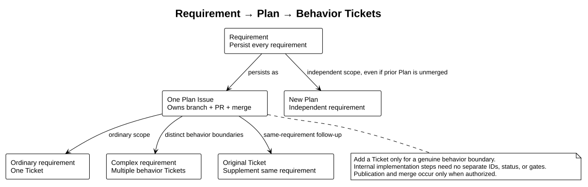
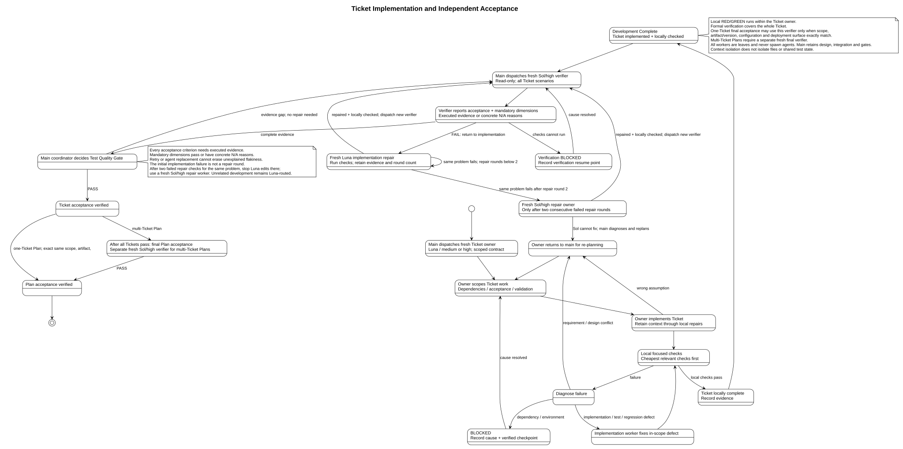

# Architecture Overview

> Type: Architecture
> Status: Active
> Scope: Component responsibilities, development lifecycle, and installation flow of this repository's workflow package

## Scope

This repository packages a main-agent-led development-workflow orchestrator for
Codex and Claude Code with a fixed workflow topology and adaptive multi-agent
execution. The orchestrator owns stage routing and quality gates; specialist
procedures remain inside their own `SKILL.md` files.

## Components

| Component | Responsibility |
|---|---|
| `codex-development-workflow` | Routes each request to the stage workflow that owns it — `plan-workflow`, `develop-workflow`, `verify-workflow`, `publish-workflow`, or `integrate-workflow` — carries the invariants shared by all stages, and provides the optional full orchestration for an explicitly authorized end-to-end delivery. |
| Adaptive execution waves | The main agent directly dispatches fresh Ticket owners and independent verifiers; an owner retains context across the Ticket and local repairs. |
| Subagent selection | The main agent and host choose the best available built-in or project-defined subagent from the task contract and agent description; no task class is hard-coded to a named agent. |
| Codex worker model routing | Root [`SKILL.md`](../../SKILL.md#codex-worker-model-routing) owns portable worker defaults, precedence and escalation; direct develop/verify/test coordinators read the corresponding root from their active installation through the discovered Skill catalog. |
| `.codex/config.toml` and `.codex/agents/` | Separate project-local coordinator/worker configuration and optional scoped agent definitions; [installation.md](../deployment/installation.md#codex-model-routing) owns configuration and installation boundaries. |
| `plan-to-ticket` | Defines one Plan per independent requirement, ordinarily with one complete execution/acceptance Ticket; multiple Tickets require distinct behavioral, dependency, or acceptance boundaries. It persists Plan/Ticket Issues before branch work. |
| GitHub Issues connector | Stores the durable Plan/Ticket records; the Plan owns status, dependency index, branch, base, and PR metadata while child Tickets own behavior and acceptance metadata. |
| `test-workflow` | Maps acceptance criteria to evidence, selects mandatory risk dimensions, and closes the Test Quality Gate only when required verification is satisfied. |
| `repo-current-state` | Maintains the compact, verified recovery point on the same Plan branch and PR as the work it describes. |
| `repo-documentation` | Governs documentation as one canonical document per fact: the documentation impact check, canonical ownership, the documentation index, duplicate and orphan detection, document lifecycle, and the diagram policy. |
| `docs/skills/` | Specialist README, architecture, usage, and supporting documentation. |
| `scripts/install-all.sh` | Installs the root orchestrator and local specialist bundles. |
| `references/skill-map.md` | Maps each managed bundle to its local source and both host destinations. |
| `data-document-redaction` | Scans the files staged for the next commit before publication and repeats the scan after subsequent fixes that change staged content. |
| `github-push-when-ready` | Guards feature-branch publication through Commit, Push, and PR readiness. |

The main agent centrally owns requirements, architecture, planning, cross-
Ticket dependency ordering, execution-wave scheduling, integration, stage-gate
decisions, and final judgment. It directly dispatches fresh Ticket owners,
independent-module helpers when safe, and independent verifiers. Ticket owners
retain context across their Ticket and local repairs; all workers
are leaves and never dispatch workers. This delegation preserves the workflow topology.
[`AGENTS.md`](../../AGENTS.md#multi-agent-delegation) owns the
scheduling policy. Dependent or overlapping work remains sequential, and the
main agent must not duplicate active delegated work.

## Development process

### Overview diagrams


Source: [`components-overview.puml`](../diagrams/components-overview.puml)



Source: [`plan-ticket.puml`](../diagrams/plan-ticket.puml)


Source: [`test-quality-gate.puml`](../diagrams/test-quality-gate.puml)


Source: [`docs-publication-flow.puml`](../diagrams/docs-publication-flow.puml)

These PlantUML overviews summarize responsibilities and major decisions.
The detailed views below show exact workflow loops and lifecycle detail in the
same source format.

### Component responsibilities and records


Source: [`diagrams/components.puml`](diagrams/components.puml)

Skills are procedures used by the coordinator and dispatched workers. The
diagram separates lifecycle orchestration, specialist responsibilities, GitHub
Issues as Plan/Ticket authority, GitHub as publication surface, and repository
documentation as persisted project knowledge.

### End-to-end lifecycle


Source: [`diagrams/architecture.puml`](diagrams/architecture.puml)

### Stage workflows

```text
Requirement
  -> plan-workflow        understand, design, decompose, persistence decision
  -> develop-workflow     implement to Development Complete
  -> verify-workflow      verification scope, level, and conclusion
  -> publish-workflow     docs/redaction, requested commit/push/PR boundary
  -> integrate-workflow   merge once, cleanup, close Issues, state and docs
  -> Evaluate workflow
```

Stage routing stops at the requested boundary. Local verified functionality is
a normal checkpoint; the user controls publication/merge timing and scope. See
[publication decisions](../workflow/usage.md#publication-decisions).
The full orchestration runs these stages only for an explicitly authorized
end-to-end delivery of the stated batch:

```text
Create Plan branch
  -> Implement all Plan Tickets
  -> Test Quality Gate
  -> Documentation impact check
  -> Update Repo_Current_State.md if represented state changed
  -> Redaction scan if applicable
  -> Commit
  -> Push branch
  -> Create / Update PR
  -> Merge the PR once
  -> Delete branch
  -> Update main
  -> Validate PR-included State / Docs
  -> Close Plan + Tickets
  -> If separately authorized: external release handoff (outside this workflow)
  -> Evaluate workflow
```

Feature, Bug, Refactor, and Docs are profiles of these stages, not separate
workflows: they change verification breadth, while every requirement is
persisted before branch work.
Planning depth and verification level may vary. Authorized commits and pushes
on a non-default branch may stop at their requested boundary; integration into
the default branch still requires the guarded PR and merge path. Every
independent requirement is recorded as one Plan Issue and one or more child
Ticket Issues before branch work. Ordinary work uses one Ticket; multiple
Tickets need distinct behavioral, dependency, or acceptance boundaries.

`plan-to-ticket` creates the Plan Issue and all child Ticket Issues before the
Plan branch is created. Each Ticket loads only the context needed for its
acceptance criteria. A wrong design assumption returns to planning before scope
expands.

### Fixed topology and adaptive execution waves

```text
Fixed stages: plan -> develop -> verify -> publish -> integrate
Ticket execution: main -> fresh Ticket owner -> fresh whole-Ticket verifier
Final delivery verification: fresh whole-Plan verifier; exact one-Ticket scope may coalesce
Main: readiness -> capacity-bounded Ticket wave -> integrate evidence -> gates
```

Worker selection and concurrency adapt to actual host capacity, dependencies
and ownership. All active roles count toward capacity; no project-set cap or
total/lifetime quota applies. Main plus one worker requires two slots, and work
queues when capacity is exhausted. Parallel module work requires fixed
interfaces, independent decisions and verification, isolated workspaces or
returned patches, and non-overlapping files, interfaces, configuration, and
test state. Dependent Tickets may be prepared read-only, but writes wait for
prerequisite independent PASS. See the canonical
[AGENTS.md policy](../../AGENTS.md#multi-agent-delegation); local development
checks do not replace independent verification.

### Requirement-to-Ticket lifecycle

The detailed Plan/Ticket lifecycle uses two linked views so each return edge has
a clear scope and exit condition:


Source: [`diagrams/ticket-lifecycle.puml`](diagrams/ticket-lifecycle.puml)



Source: [`diagrams/ticket-loop.puml`](diagrams/ticket-loop.puml)

Dependency waits resume only after fresh evidence; a failed Ticket returns to
diagnosis and affected validation, while a design conflict returns to planning.
A failed validation or publication step returns to the recorded failed stage, never a later gate.
Only the single verified Plan merge permits `done` and Plan/Ticket Issue closure.
There is no outer per-Ticket merge loop. `planned`, `in_progress`, `blocked`,
and `in_review` remain open states; `Status` is workflow metadata, not a claim
that GitHub provides these workflow states automatically.

Each Plan records one independent requirement and owns one branch and, when
delivery is authorized, one PR and merge. An ordinary requirement uses one
Ticket; a complex requirement may use multiple behavior Tickets only for
distinct behavioral, dependency, or acceptance boundaries. Supplementary work
for the same requirement updates its Ticket, adding another only for a distinct
boundary. An independent requirement always starts a new Plan, even before
another Plan merges. An expanded same-requirement Plan with an open PR retains
its URL but returns to `in_progress`, invalidating impacted readiness until
revalidation and an authorized PR update. See the
[Plan scope contract](../../skills/plan-to-ticket/SKILL.md#scope-and-sizing) and
[publication rules](../../skills/github-push-when-ready/SKILL.md#readiness-and-boundaries).
Each Ticket is a complete execution and acceptance unit with scope, exclusions,
dependencies, Function Checklist, observable criteria, test strategy, cases,
and validation. Real Ticket dependencies control work order within the Plan.

### Persistent ticket authority

GitHub Issues are the sole durable authority for Plans and Tickets created by
`plan-to-ticket`. Every requirement has one Plan Issue linking to one or more
child Ticket Issues. The Plan retains `Status`, `Branch`, `Base`, `PR`, and
completion metadata; each child Ticket retains its Plan link, goal, scope,
dependencies, Function Checklist, acceptance criteria, and validation but does
not own a branch or PR. The workflow blocks when required Issue reads or
writes fail; it does not create a local Markdown mirror or treat chat output as
completion.

`Repo_Current_State.md` remains a compact recovery pointer to the active Issue,
not a backlog or second ticket database.

### Plan branch

A persisted Plan owns one branch created or resumed before editing, after its
Plan and child Ticket Issues exist. The Plan branch is named
`<type>/<plan-id>-<short-description>`. Ticket dependencies are completed and
validated on that branch; no prerequisite Ticket merge is required. Parallel
workers use isolated worktrees or return patches/findings for integration, and
never create a second delivery branch. The Plan Issue is the one-to-one owner
of its branch: record `Branch` and `Base` before editing, set Plan
`Status: in_progress` when work starts, and require the Plan PR head/base to
match those fields.

### Ticket worker boundaries

The [canonical policy](../../AGENTS.md#multi-agent-delegation) owns worker
contracts, safe waves, model routing, repair escalation and failure recovery.
Root, develop, verify and test Skills retain minimum executable rules for
installed use without AGENTS.md. Verifiers read without repair edits; a failed
acceptance returns to implementation, then a fresh verifier checks affected
functionality. A fresh Sol/high verifier covers Ticket acceptance; for a
one-Ticket Plan with exactly matching scope, artifact/version, configuration,
and deployment surface, that new check may also satisfy final Plan acceptance.
Otherwise final Plan acceptance uses a separate fresh whole-Plan verifier.
The main agent retains integration, the Test Quality Gate and final judgment.

[Context Management](../../AGENTS.md#context-management) owns scoped worker
context, concise handoffs and durable Issue checkpoints at integrated waves,
Development Complete, acceptance failures, and pause or retirement. The state snapshot remains repository recovery truth; it does not
replace those checkpoints.

### Ticket execution

```text
Acceptance criteria -> Test strategy -> Minimal change
                    -> Focused validation -> Fix / Refactor
                    -> Ticket complete
```

Test-first is preferred for meaningful behavioral changes, bug fixes,
regressions, API behavior, core business logic, data processing, and high-risk
code. It is not forced for documentation, configuration, dependency updates,
styling, typo fixes, simple refactors, or exploratory work.

### Bounded verification

| Level | Purpose |
|---|---|
| `minimal` | Tiny and non-behavioral changes. |
| `focused` | Default evidence for one Ticket. |
| `regression` | Bug fixes and cross-module risk. |
| `full` | High-risk or release verification. |

The verification level controls breadth, not PASS. Stop only after every
acceptance criterion has executed evidence and every mandatory risk dimension
has passed or has a concrete N/A reason. Escalate breadth when acceptance
criteria, failure evidence, affected boundaries, release requirements, or the
risk profile justify it.


### Host-specific project configuration

Each host exposes its own agent runtime. Codex reads `.codex/config.toml`, may
use built-in agents, and may also read project-defined agents from
`.codex/agents/` when present. The root Skill's canonical
[Codex worker model routing policy](../../SKILL.md#codex-worker-model-routing)
travels with installation and is read before dispatch, including
direct stage invocation. Its discovery uses the host catalog rather than
checkout-dependent paths and retains the active entrypoint's installation
association when global/project catalog names overlap. Ticket owners, module
helpers, verifiers, and repair workers execute assigned leaf roles without
routing models or spawning agents; the main agent selects their models under
the root policy. Separate repository-local configuration is documented
in the [installation guide](../deployment/installation.md#codex-model-routing).
Claude Code may use its built-in agents and
project-defined agents from `.claude/agents/`. Neither host reads the other's
project-agent directory. Agent choice and escalation are dynamic and driven by
the task contract plus the available agent descriptions; the repository does
not hard-code task classes to agent names. The scheduling policy lives in
[`AGENTS.md`](../../AGENTS.md#multi-agent-delegation), and
[installation.md](../deployment/installation.md) owns the per-host
configuration procedure.

### Staged-output redaction gate

Run the gate on the files staged for the next commit and repeat it after any
subsequent fix that changes staged content. The scan reports `pass`,
`findings`, `needs_review`, `noop`, or `error`; only `pass` and `noop` continue,
and a recorded skip is allowed only when the staged change carries no sensitive
surface.

The packaged specialist covers the staged commit set only. Document, PDF,
Office, OCR, repository-wide, and non-Git export sanitization are out of scope
and need project-specific tooling and review.

## Installation flow

1. Obtain a checkout of this repository and run `scripts/install-all.sh` with `--target codex` (default) or `--target claude`.
2. The installer validates each local `SKILL.md` and copies the configured bundle into the target destination (`${CODEX_HOME:-$HOME/.codex}/skills` or `$HOME/.claude/skills`) or `--dest PATH`.
3. Existing marked skills are skipped unless `--update` is used; unmarked paths
   are preserved unless `--update --adopt-legacy` explicitly moves them to a
   recoverable backup first.
4. Restart the host to discover installed skills.

The installer and [`references/skill-map.md`](../../references/skill-map.md)
must remain aligned. The
[installation and update guide](../deployment/installation.md) owns the
procedure.

## Boundaries

- The orchestrator defines stages and gates; specialist skills define detailed procedures.
- Every requirement has one Plan Issue with at least one Ticket; ordinary work uses one Ticket and a persisted Plan uses one branch and PR.
- Tests provide evidence against Ticket acceptance criteria; local verification is a valid stop.
  If delivery is elected, single-verifier Plan/branch/PR acceptance precedes the
  final publication/merge boundary.
- `Repo_Current_State.md` is the recovery point, not a session transcript or full backlog.
- `repo-documentation` owns documentation governance; `repo-current-state` owns
  only the recovery snapshot.
- Redaction is conditional and scoped to the staged commit set; it is not a mandatory transformation of every artifact.
- State / Docs that belong to delivered work are updated before commit/PR creation and travel with that PR; integration validates the merged result.
- The package does not own target-project source code, application data, or deployment infrastructure.
- Specialist skills are vendored under `skills/` and updated through this repository's normal version-control process.
