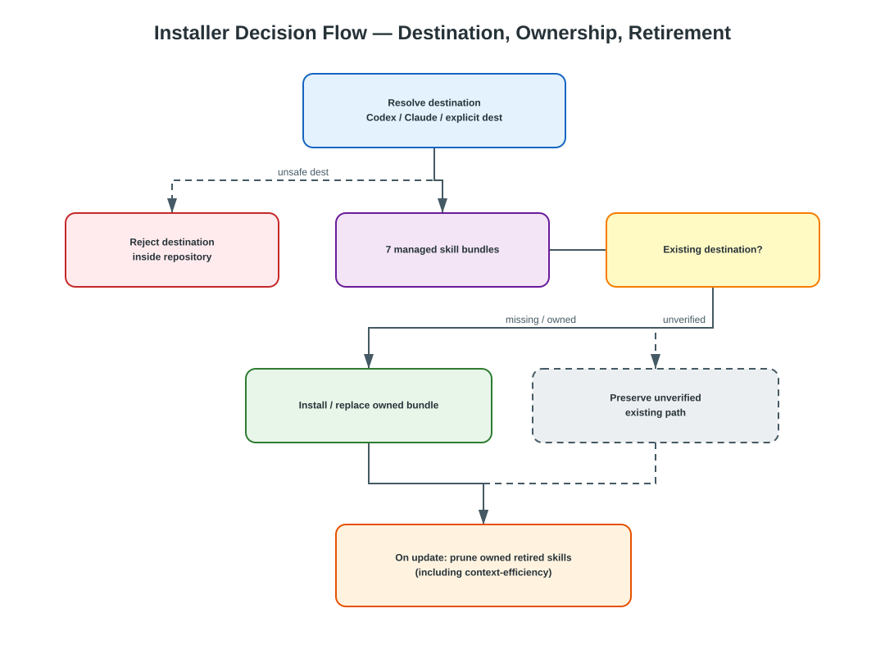
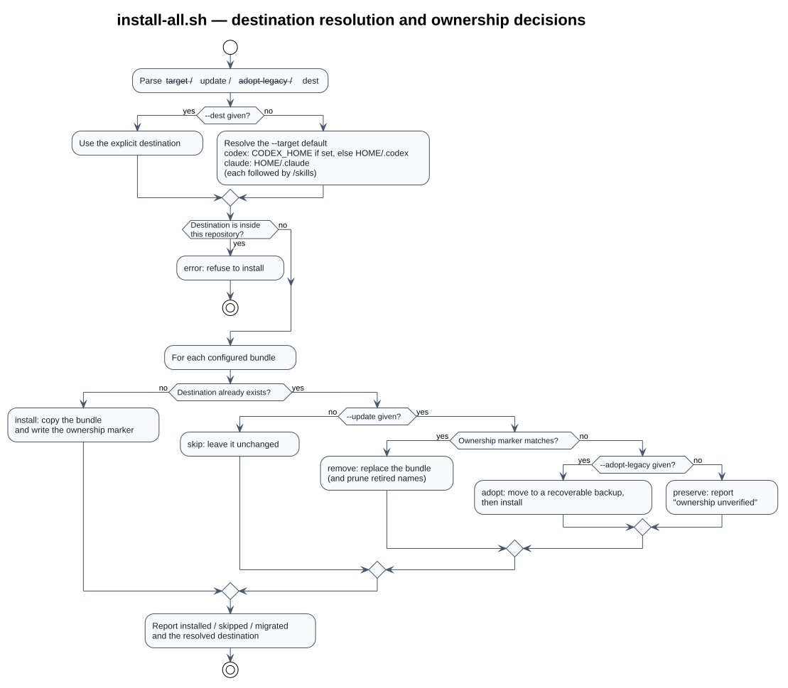

# Installation and Update Guide

> Type: Guide
> Status: Active
> Scope: Installing, updating, and verifying this repository's skill bundles for Codex and Claude Code, and the host-specific configuration each host reads

## Prerequisites

The installer requires:

- Bash;
- `tar`; and
- a complete checkout of this repository.

Restart the host after installation so the new skill directories are
discovered.


## Install the workflow

The supported installation is run from a checkout so the installer and all
bundled specialist skills are available together:

```bash
git clone https://github.com/i-zrhe2016/codex-development-workflow.git
cd codex-development-workflow
bash scripts/install-all.sh
```

Select the host with `--target`. Codex is the default:

| `--target` | Destination | Reads agent definitions from |
|---|---|---|
| `codex` (default) | `${CODEX_HOME:-$HOME/.codex}/skills` | `.codex/agents/` |
| `claude` | `$HOME/.claude/skills` | `.claude/agents/` |

```bash
bash scripts/install-all.sh --target claude
```

Both targets install the same twelve managed bundles under the bare skill name; the
Claude target omits the Codex-only `agents/openai.yaml` metadata, so the two
installations are not byte-for-byte identical. The destination root and that
metadata are the only differences. `--dest PATH` overrides either destination.

For an auditable installation, inspect the checkout and the managed source map
before running the local installer:

```bash
sed -n '1,220p' scripts/install-all.sh
sed -n '1,160p' references/skill-map.md
bash scripts/install-all.sh
```

## Update an existing installation

Use `--update` to replace already-installed workflow skills:

```bash
bash scripts/install-all.sh --update                  # Codex destination
bash scripts/install-all.sh --target claude --update  # Claude Code destination
```

`--update` acts on the destination selected by `--target` (or `--dest`), so an
update without `--target` always targets the Codex default. Repeat the target
you installed with.

Without `--update`, an existing skill directory is reported as `skip` and is
left unchanged. With `--update`, an existing destination is replaced only when
it carries the matching marker written by this installer; an unmarked path is
preserved and reported as `ownership unverified`. Retired skill destinations, including previously managed `context-efficiency`,
are removed under the same ownership check. Back up any local edits before
using this option.



Editable source: [`installer-overview.drawio`](../diagrams/drawio/installer-overview.drawio)

Detailed diagrams-as-code view:



Source: [`diagrams/installer-decision-flow.puml`](diagrams/installer-decision-flow.puml)

The marker is stored as the hidden file
`.codex-development-workflow-managed` inside each installed bundle. This
prevents an update from recursively deleting an unrelated skill that happens
to use a retired or current workflow name. Installations created before this
marker existed remain untouched by the default update. To migrate one of those
installations, explicitly opt in:

```bash
bash scripts/install-all.sh --update --adopt-legacy
```

This one-time adoption moves every unmarked configured destination to a hidden,
recoverable backup under the skills directory before updating or pruning it;
the command requires `--update`. Review the printed backup path before removing
it manually.

## Choose another destination

Use `--dest PATH` when the host uses a non-default skills directory:

```bash
bash scripts/install-all.sh --target claude --dest /path/to/skills
```

`--dest` overrides the `--target` destination and can be combined with
`--update`.

## Verify the result

After the command completes, verify the destination the installer printed
contains the expected skill folders and each folder contains `SKILL.md`. Set
`SKILLS_DIR` to that printed location first:

```bash
SKILLS_DIR="$HOME/.claude/skills"   # or ${CODEX_HOME:-$HOME/.codex}/skills
find "$SKILLS_DIR" -mindepth 2 -maxdepth 2 -name SKILL.md -print | sort
```

The installer prints the number of installed and skipped skills, the resolved
destination, and the host to restart.

## Host-specific configuration

The installer copies managed skills only. Project-scoped runtime configuration
is not installed into another repository, and each host reads its own:

| File | Read by | Purpose |
|---|---|---|
| `.codex/config.toml` | Codex | Enables subagents and caps concurrent spawned-agent threads at three, excluding the main thread. The cap is a ceiling; the main agent chooses actual wave concurrency dynamically. |
| `agents/openai.yaml` (in each bundle) | Codex | Skill interface metadata. The Codex target requires it and installs it; the Claude target installs the bundle without it, because Claude Code never reads it. |

Codex may use built-in agents and project-defined agents under
`.codex/agents/` when present. Claude Code may use built-in agents and
project-defined agents under `.claude/agents/`. Claude Code does **not** read
`.codex/` and does not read `agents/openai.yaml`; Codex does **not** read
`.claude/agents/`. Neither host reads the other's project-scoped
configuration. Agent selection is dynamic; the workflow does not require a
fixed task-to-agent mapping.

Project-scoped runtime configuration stays in this checkout and is not installed
by `scripts/install-all.sh`.

### Project instructions for each host

The delegation policy is owned by [`AGENTS.md`](../../AGENTS.md), and the two
hosts reach it differently:

- **Codex** reads `AGENTS.md` directly as its project instruction file.
- **Claude Code** reads `AGENTS.md` as project instructions only when no
  `CLAUDE.md` exists in the working directory or above it (v2.1.277+). This
  repository intentionally versions `AGENTS.md` and no `CLAUDE.md`, so the
  fallback applies here.

When a target project already has its own `CLAUDE.md`, Claude Code will not fall
back to that project's `AGENTS.md`. That project must then carry the delegation
policy itself — copy the "Multi-Agent Delegation" section into its `CLAUDE.md`,
or add a `CLAUDE.md` that links to it.

## Installation behavior and trust boundary

The installer copies only the configured paths from this checkout; it does not
access GitHub, install dependencies, or execute specialist scripts during
installation. Review changes to
[`references/skill-map.md`](../../references/skill-map.md) and
[`scripts/install-all.sh`](../../scripts/install-all.sh) before publishing or
using a new bundle mapping. Review changes under `skills/` as the source code
for the specialist skills themselves. Review migrated explanatory material
under [`docs/skills/`](../skills/) when changing a skill's documented behavior.
