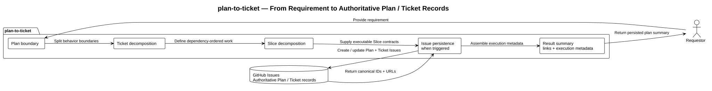

# Plan to Ticket

`plan-to-ticket` is a GitHub Issues persistence adapter.

The model performs planning, decomposition, sequencing, acceptance-criteria design,
verification design, and delegation with its native capabilities. This Skill does
not teach or constrain those abilities. It only persists a structure the model
has already decided into this repository's authoritative Issue format.

Runtime source: [`skills/plan-to-ticket/`](../../../skills/plan-to-ticket/).

## What it owns

- stable Plan and Ticket markers;
- repository-scoped `T####` allocation;
- canonical Issue titles;
- Plan/Ticket metadata blocks;
- one Plan -> one branch -> one PR -> one merge ownership;
- status transitions tied to repository delivery events;
- duplicate detection and reuse;
- blocked behavior when Issue persistence fails.

## What it does not own

- requirement analysis;
- planning or decomposition;
- Ticket sizing;
- Slice design;
- dependency reasoning;
- acceptance criteria;
- test strategy;
- implementation sequencing;
- delegation.

Those remain native model work.

## Persistence records

Plan Issues use:

```yaml
Status: planned
Branch: <branch>
Base: <base>
PR: null
Tickets: [T0001, T0002]
```

Ticket Issues use:

```yaml
Plan: <canonical Plan Issue URL>
Status: planned
Dependencies: []
```

Stable markers:

```text
<!-- codex-plan-id: <stable-kebab-slug> -->
<!-- codex-ticket-id: T0001 -->
```

## Architecture



Source: [plan-to-ticket-architecture.puml](diagrams/plan-to-ticket-architecture.puml).

## Maintenance

Keep this bundle limited to repository-specific persistence rules. If a rule
describes a capability the model already has natively, remove it from the Skill
instead of encoding it here.
