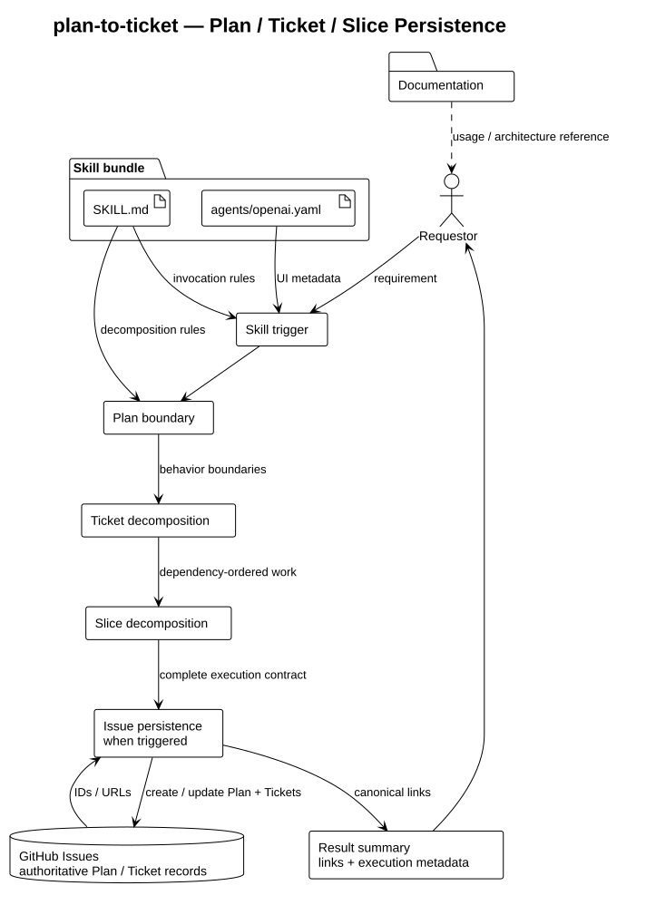

# Architecture Overview

## Scope

This repository packages the `plan-to-ticket` specialist inside a larger
main-agent workflow. Its job is to convert a change request into a compact
plan and small engineering Slices with boundaries that can support optional
delegation, then persist the plan and tickets to GitHub Issues. There is no
application runtime, custom API client, or local ticket database in this
package; GitHub Issues are the workflow's external durable store.

## Logical architecture

The source for this diagram is
[plan-to-ticket-architecture.puml](diagrams/plan-to-ticket-architecture.puml).
It describes the behavior exposed by the skill package rather than an
application infrastructure topology.

## Responsibilities

| Asset | Responsibility | Boundary |
| --- | --- | --- |
| [`skills/plan-to-ticket/SKILL.md`](../../../skills/plan-to-ticket/SKILL.md) | Defines trigger metadata, planning rules, Issue persistence contract, Slice structure, scope constraints, and verification expectations. | It plans and persists Issue records; it does not implement the planned change. |
| [`skills/plan-to-ticket/agents/openai.yaml`](../../../skills/plan-to-ticket/agents/openai.yaml) | Supplies the display name and short interface description. | It describes the skill in the interface; it does not define planning behavior. |
| GitHub Issues connector | Creates, finds, and updates the parent plan Issue and one Issue per ticket. | It is the external durable authority; no local Markdown mirror is maintained. |
| This documentation package | Explains the bundle structure, behavior, output contract, and maintenance expectations. | Documentation does not add executable behavior. |

## Request flow

1. A requestor provides a feature idea, requirement, bug-fix plan, refactor plan, or similar project change.
2. Codex uses the frontmatter description in `SKILL.md` to determine whether this skill applies.
3. The planning instructions use the available repository context and identify milestones, dependencies, scope boundaries, and verification.
4. The skill resolves the repository's GitHub target, searches stable markers, and creates or updates the parent plan Issue and ticket Issues before implementation branches start.
5. The skill assigns or resumes one branch and base branch per ticket, using the
   updated default branch for new dependency-ready tickets.
6. The successful output follows the contract in `SKILL.md`: a `Plan` section followed by focused `Tickets`/Slice sections containing canonical Issue links and branch handoff fields.
7. The main agent uses the Slices as implementation input, either executing
   them sequentially or passing independent, bounded work through the
   workflow's delegation gate.

## Design boundaries

- The skill is a single cohesive module because its trigger, planning rules, and output format are tightly coupled.
- The interface metadata is kept separate from behavior so presentation changes do not alter planning semantics.
- The skill does not prescribe a project framework, dependency, command, or deployment platform unless repository context establishes it. It requires the available GitHub Issues connector for persistence but does not implement a custom API client.
- Slice verification describes observable checks. It does not claim that implementation has already been completed.
- A required GitHub Issue failure blocks completion; chat output and local Markdown are not persistence fallbacks.
- The skill does not force multi-agent handoffs or parallel implementation; the
  parent workflow decides whether an independent Slice is safe to delegate.

## Slice output contract

Each behavior Slice should expose:

- Goal and Scope;
- Out of scope and Dependencies;
- Branch and Base branch;
- Acceptance Criteria;
- Relevant Context / Files;
- Test Strategy and Test Level;
- Test Cases; and
- Validation Command.

## Change guidance

When changing planning behavior:

1. Update the relevant rule or output-contract section in
   `skills/plan-to-ticket/SKILL.md`.
2. Check that the architecture boundaries and request flow in this document remain accurate.
3. Update this documentation index or repository layout if files or responsibilities change.
4. Verify the Markdown structure, frontmatter, and any rendered diagram before committing.
