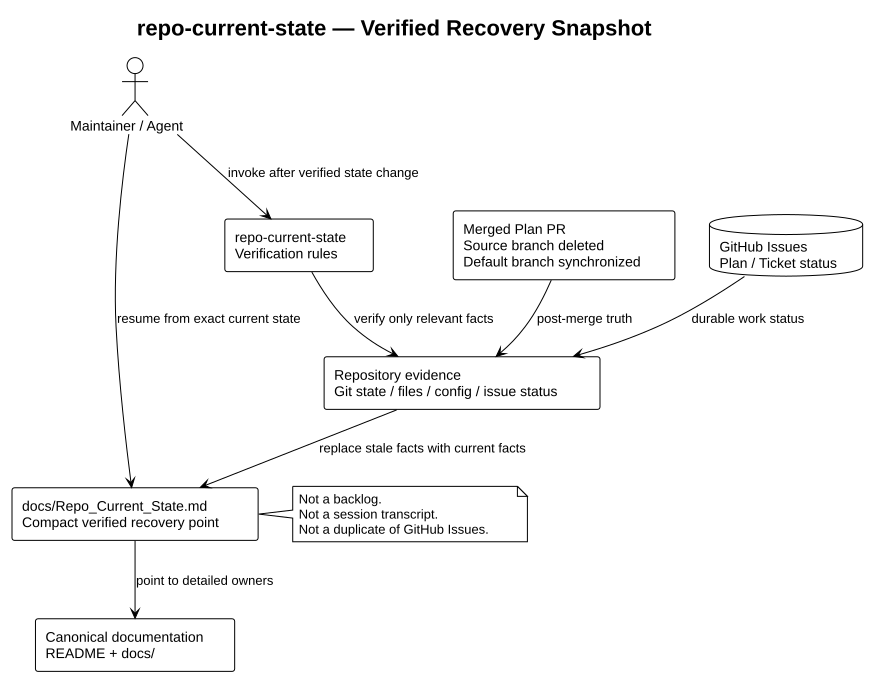

# Repository Architecture

## Scope

This repository packages the `repo-current-state` specialist inside a larger
main-agent-led workflow. Its only runtime-like behavior is the guidance in
[`skills/repo-current-state/SKILL.md`](../../../skills/repo-current-state/SKILL.md):
an agent reads repository evidence, verifies task-relevant facts, and maintains
a compact current-state document.

There is no application runtime, service boundary, database, deployment
configuration, or automated test suite in the current repository.

## Components

| Component | Responsibility |
| --- | --- |
| [`skills/repo-current-state/SKILL.md`](../../../skills/repo-current-state/SKILL.md) | Defines the state-document contract, reconciliation workflow, freshness rules, and scope boundaries. |
| [`skills/repo-current-state/agents/openai.yaml`](../../../skills/repo-current-state/agents/openai.yaml) | Supplies agent-facing display metadata for the skill. |
| Repository evidence | The files, configuration, and Git state used to verify claims. |
| [`docs/Repo_Current_State.md`](../../Repo_Current_State.md) | Stores the small, factual snapshot of the repository's current state. |
| [`README.md`](../../../README.md) and `docs/` | Provide the public entrypoint, architecture detail, and documentation index. |

## Maintenance flow

1. The maintainer or main Codex agent reads the managed `SKILL.md` and the
   existing state snapshot.
2. Only evidence relevant to the current task is inspected.
3. Verified facts are written to the target repository's
   `docs/Repo_Current_State.md`.
4. Detailed architecture and entrypoint links remain in the appropriate
   documentation files.

## Boundaries and invariants

- The current-state document describes what is true now; Git history retains
  historical changes.
- Architecture rationale belongs in architecture or decision documents, not
  in the state snapshot.
- The state snapshot must not become a backlog, test archive, or authorization
  record.
- Claims that cannot be verified from repository evidence are omitted or
  explicitly marked as unverified.
- The skill does not require multi-agent coordination or parallel state edits.
