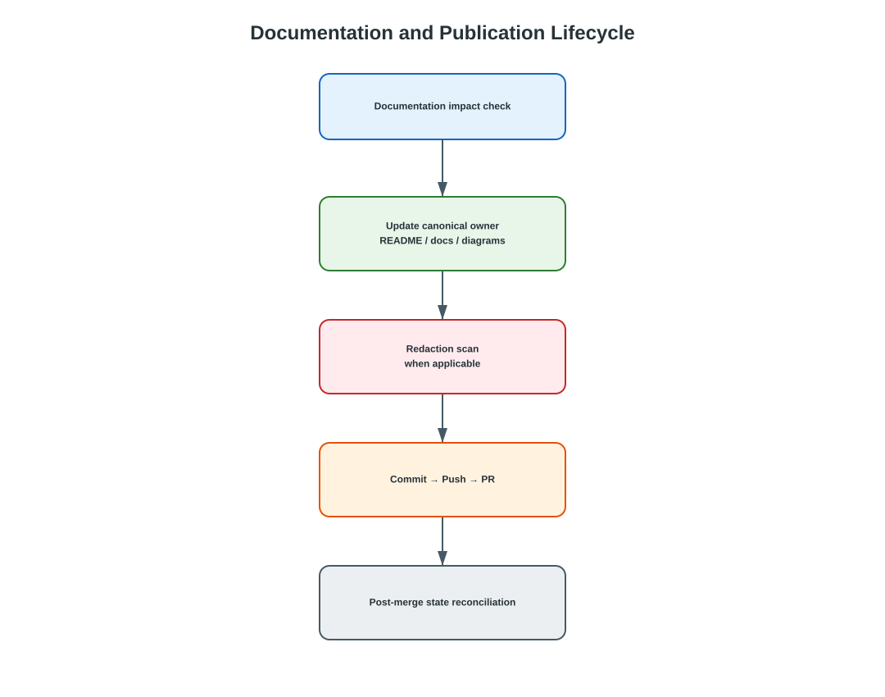
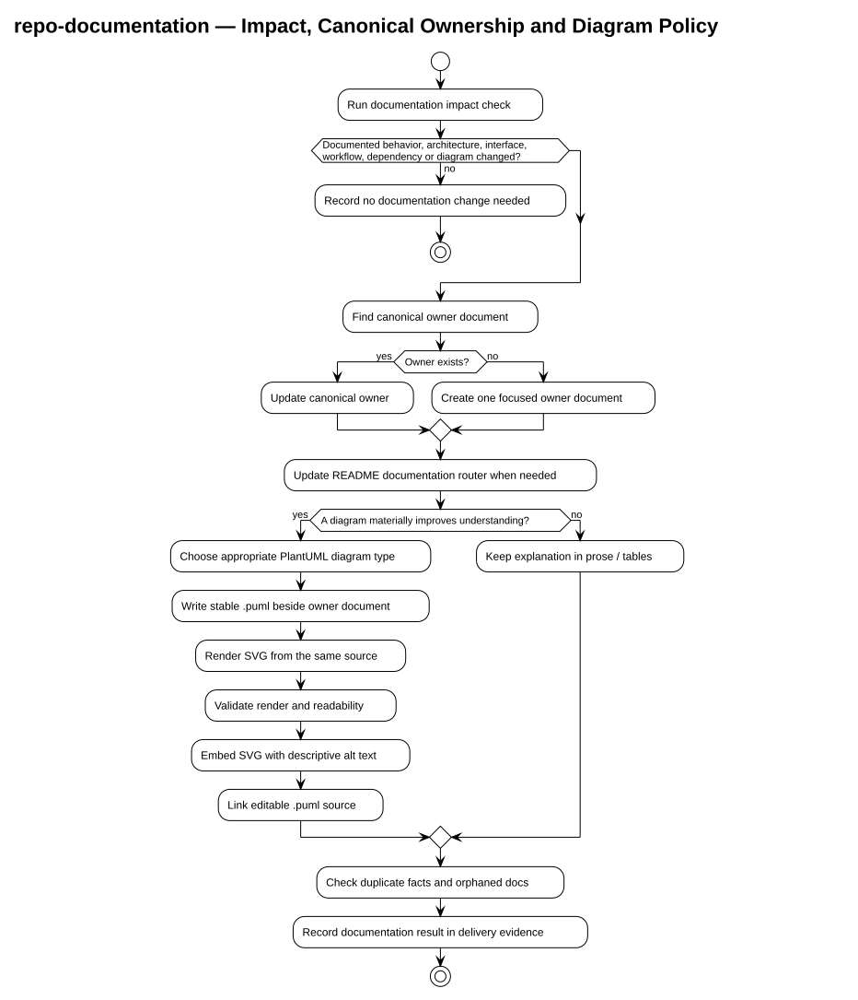

# Repo Documentation

`repo-documentation` is a Codex skill for governing repository documentation:
one fact, one canonical document, and other documents link to it. The managed
runtime source is
[`skills/repo-documentation/`](../../../skills/repo-documentation/).



Editable overview: [`docs-publication-flow.drawio`](../../diagrams/drawio/docs-publication-flow.drawio)

Detailed documentation-governance flow:



Source: [`diagrams/repo-documentation-flow.puml`](diagrams/repo-documentation-flow.puml)

## What it provides

- A governance contract in
  [`skills/repo-documentation/SKILL.md`](../../../skills/repo-documentation/SKILL.md).
- Agent-facing metadata in
  [`skills/repo-documentation/agents/openai.yaml`](../../../skills/repo-documentation/agents/openai.yaml).
- Focused references for the
  [file standard](../../../skills/repo-documentation/references/doc-file-standard.md),
  [document types](../../../skills/repo-documentation/references/document-types.md),
  [lifecycle](../../../skills/repo-documentation/references/documentation-lifecycle.md),
  and [templates](../../../skills/repo-documentation/references/templates.md).

## First-version capabilities

1. Exactly one documentation router, reached from the repository entry point:
   `docs/README.md` by default, or the existing root `README.md` when the
   repository already routes documentation from there.
2. The Markdown file standard: `kebab-case` names, one `#` title, and no
   `Last updated` field on content documents.
3. The `Type` / `Status` / `Scope` header on every content document under
   `docs/`, with the documented exceptions.
4. Canonical owner routing with duplicate detection before any new file is
   created.
5. The documentation impact check that decides whether a change needs
   documentation work at all, including whether an existing diagram still shows
   the flow it claims to show.
6. The documentation diagram policy: when a document carries a diagram, where
   its `.puml` source and rendered image live, and how they are embedded and
   kept current.

## Usage

1. Run the documentation impact check before publication for any change, and
   report the result in the change's delivery record.
2. Route each fact to the document type that owns it, and update the canonical
   document instead of creating a parallel one.
3. When the check requires documentation work, update the documentation router
   in the same change.
4. When the user asks to normalize, organize, audit, or check project
   documentation, scan `docs/`, classify, detect duplicates, orphans,
   misplacement, naming violations, missing index links, and stale claims, then
   normalize while preserving meaning.
5. Record `Draft`, `Active`, `Deprecated`, or `Superseded` in the header as the
   document's state changes; ADRs use `Proposed`, `Accepted`, `Deprecated`, or
   `Superseded` instead and are never deleted.

The impact check runs between Test and Redaction, inside the existing
`Test -> Documentation impact -> Redaction -> Commit` path. It is a required
workflow step, not an additional merge gate, and it requires no documentation
work when the change touches nothing documented.

## Boundary with repo-current-state

`repo-documentation` owns documentation governance; it does not own what is true
right now. `docs/Repo_Current_State.md` stays with
[`repo-current-state`](../repo-current-state/README.md), and this skill only
links to it. Plans and Tickets stay in GitHub Issues, and change history stays
in Git.

This repository routes its documentation from the root
[`README.md`](../../../README.md), which the skill's index contract allows
instead of `docs/README.md`. `docs/Repo_Current_State.md` keeps its
`Last verified` field. README pages and the state snapshot are exempt from the
filename and header rules, and an ADR is exempt only from the ordinary filename
and status values. Existing documents are brought into compliance as they are
modified.

## Repository layout

```text
.
├── skills/repo-documentation/
│   ├── SKILL.md
│   ├── agents/openai.yaml
│   └── references/
│       ├── doc-file-standard.md
│       ├── document-types.md
│       ├── documentation-lifecycle.md
│       └── templates.md
└── docs/skills/repo-documentation/
    ├── README.md
    └── diagrams/
        ├── repo-documentation-flow.puml
        └── repo-documentation-flow.svg
```
