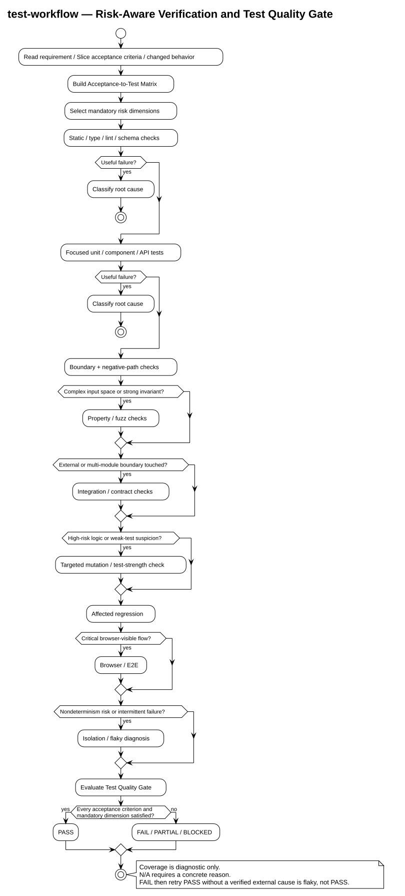

# Test Workflow

本目录迁移并维护 `test-workflow` specialist 的文档。运行时 skill 源码位于
[`skills/test-workflow/`](../../../skills/test-workflow/)；它服务于本仓库的
主 Agent / Slice workflow；它负责验证委派或主线程执行的 Slice，但不负责
决定是否拆分 Agent 或如何并行实现。

核心入口是 `test-workflow`：从需求、Slice 功能清单和验收标准提炼最小高价值
测试集，优先使用项目已有测试框架，按 `静态检查 -> focused tests ->
integration/regression -> browser/E2E` 的成本梯度执行；复杂或高风险行为采用
RED -> GREEN，普通失败先直接诊断修复，重复/原因不明/高风险失败再升级到
targeted code review。



渲染产物：[SVG](diagrams/test-workflow-flow.svg) / [PNG](diagrams/test-workflow-flow.png)；
图源：[test-workflow-flow.puml](diagrams/test-workflow-flow.puml)。该图使用
`plantuml-skill` 通过公共 Kroki 渲染，内容仅包含公开的工作流信息。

## Managed skill

| Skill | 用途 | 运行时入口 |
|---|---|---|
| `test-workflow` | 通用单元、组件、API、集成、回归和条件式浏览器验证 | [`skills/test-workflow/SKILL.md`](../../../skills/test-workflow/SKILL.md) |

## 文档索引

- [通用测试工作流架构](architecture.md)：测试梯度、职责边界、风险分支和失败处理。
- [通用测试工作流运行手册](usage.md)：模式选择、验收清单、执行顺序和报告格式。

## 验证级别

| Level | 用途 |
|---|---|
| `minimal` | 微小、文档、配置、样式、依赖、typo 或简单重构。 |
| `focused` | 默认；直接覆盖当前 Slice 验收标准的最小检查。 |
| `regression` | 缺陷修复、跨模块变更或已有回归风险。 |
| `full` | 高风险、发布门禁或明确要求完整套件。 |

选定级别通过后默认停止扩展；只有验收标准、失败证据、受影响边界、发布
要求或用户明确要求时才升级验证范围。

## 推荐执行顺序

```text
Requirement / Slice
        |
        v
Acceptance + Test Cases
        |
        v
Static / Type / Lint
        |
        v
Focused automated tests
        |
        +-- complex/high-risk --> RED -> Implement -> GREEN
        |
        v
Integration / affected regression
        |
        +-- browser-visible --> Browser / E2E
        |
        v
Test evidence
```

原则：使用能可靠证明行为的最低成本测试层，不把浏览器 E2E 当默认反馈循环，也不为了 GREEN 放宽断言、增加盲目 retry 或固定 sleep。

## 维护约定

- 优先复用项目已有测试框架、fixture、helper 和命令。
- 每个 Slice 的内循环保持 focused；多个 Slice 完成后再运行必要的集成/回归测试。
- 浏览器验证只用于真实用户交互或明确要求的 E2E 行为。
- 文档中的页面地址、账号、Cookie、Token 和测试数据使用占位符，不写入真实值。
