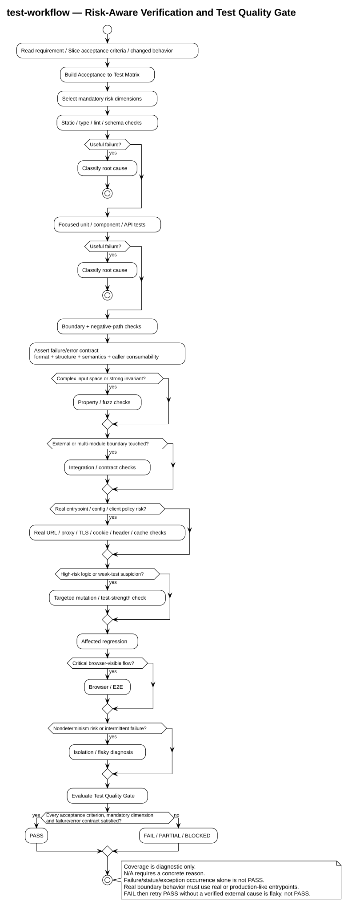

# Test Workflow

本目录迁移并维护 `test-workflow` specialist 的文档。运行时 skill 源码位于
[`skills/test-workflow/`](../../../skills/test-workflow/)；它服务于本仓库的
Ticket workflow：每个 Ticket（含文档、配置、测试）均由全新实现 worker 执行
本地反馈，独立全新验证 worker 执行该 Ticket 全部 scenario；主代理保留最终门禁。调度与干净上下文规则由
[AGENTS.md](../../../AGENTS.md#multi-agent-delegation) 定义，已派发 worker 不再创建代理。

核心入口是 `test-workflow`：先建立 Acceptance-to-Test Matrix，再从变更风险
选择 mandatory test dimensions，并按 `静态检查 -> focused -> boundary/negative
-> property/fuzz -> integration/contract -> mutation -> regression -> browser/E2E
-> isolation/flaky` 的成本梯度执行。复杂或高风险行为采用 RED -> GREEN；
最终是否 PASS 由 Test Quality Gate 决定，而不是仅由某个 test level 变绿决定。
公共边界上的成功、失败和异常路径属于同一 caller-consumable contract：错误或
失败结果也必须断言格式、结构、语义和调用方可消费性，不能只证明出现了状态码、
异常或进程失败。
涉及身份、session、权限、租户或受保护操作时，AuthN/AuthZ 是 mandatory
dimension，并且 authentication 与 authorization 分开证明：前者覆盖身份、
session lifecycle、cookie/token 有效性，后者覆盖权限、tenant/object ownership、
fail-closed 和 denied operation 的 protected side-effect absence。
每个测试都必须是 falsifiable：它声称防护的缺陷出现时应失败；mock-called、
value-exists、no-exception 或 status-only assertion 不能单独作为保护，除非这正是契约。
当行为依赖传输或部署边界时，测试应覆盖调用方真实经过的入口和客户端规则：
协议、域名、端口、路径前缀、反代、TLS、redirect、cache、header、cookie、
token、CORS 等都可能是契约的一部分。


Overview source: [`test-quality-gate.puml`](../../diagrams/test-quality-gate.puml)

详细验证梯度继续由 PlantUML diagrams-as-code 维护：



图源：[test-workflow-flow.puml](diagrams/test-workflow-flow.puml)。规范产物使用
[SVG](diagrams/test-workflow-flow.svg)，与 PlantUML 图源保持同步。

## Managed skill

| Skill | 用途 | 运行时入口 |
|---|---|---|
| `test-workflow` | 通用单元、组件、API、集成、回归和条件式浏览器验证 | [`skills/test-workflow/SKILL.md`](../../../skills/test-workflow/SKILL.md) |

## 文档索引

- [通用测试工作流架构](architecture.md)：测试梯度、职责边界、风险分支和失败处理。
- [通用测试工作流运行手册](usage.md)：模式选择、验收清单、执行顺序和报告格式。

## 验证级别

| Level | 用途 |
|---|---|
| `minimal` | 微小、文档、配置、样式、依赖、typo 或简单重构。 |
| `focused` | 默认；直接覆盖当前 Slice 验收标准的最小检查。 |
| `regression` | 缺陷修复、跨模块变更或已有回归风险。 |
| `full` | 高风险、发布门禁或明确要求完整套件。 |

Level 只控制验证广度，不直接决定 PASS。只有所有 mandatory risk dimensions
已满足，或以具体理由标记 N/A，Test Quality Gate 才能关闭；需要扩大 suite
时仍按风险和证据逐级升级。

## 推荐执行顺序

```text
Requirement / Slice
        |
        v
Acceptance + Test Cases
        |
        v
Acceptance-to-Test Matrix
        |
        v
Static / Type / Lint
        |
        v
Focused automated tests
        |
        +-- complex/high-risk --> RED -> Implement -> GREEN
        |
        v
Boundary / Negative
        |
        v
Failure/error contract assertions
        |
        +-- identity/permission risk --> AuthN / AuthZ
        |
        +-- complex inputs/invariants --> Property / Fuzz
        |
        v
Integration / Contract
        |
        +-- real entry/config risk --> Real Entrypoint / Config Matrix
        |
        +-- high-risk/weak-test suspicion --> Mutation
        |
        v
Affected Regression
        |
        +-- browser-visible critical flow --> Browser / E2E
        |
        v
Isolation / Flaky check
        |
        v
Test Quality Gate
```

原则：使用能可靠证明行为的最低成本测试层，不把浏览器 E2E 当默认反馈循环，也不为了 GREEN 放宽断言、增加盲目 retry、固定 sleep，或把“发生了失败”当成失败契约已满足。

## 维护约定

- 优先复用项目已有测试框架、fixture、helper 和命令。
- 每个 Slice 的内循环保持 focused；多个 Slice 完成后再运行必要的集成/回归测试。
- Coverage 只作为诊断信号，不能替代 assertion quality 或 acceptance evidence。
- Failure/error paths 必须验证调用方看到的格式、结构、语义和可操作性；状态或异常发生本身不够。
- AuthN/AuthZ 必须在相关时作为 mandatory dimension：分开验证身份/session/cookie-token 和权限/ownership/fail-closed，并确认拒绝操作没有受保护副作用。
- Assertion strength 必须可证伪；mock-called、value-exists、no-exception、status-only 不能替代契约断言。
- Real entrypoint checks 覆盖真实 URL、协议、代理链、TLS、路径前缀、header/cookie/token、缓存和关键配置组合。
- Retry 只能用于诊断；同一提交出现 FAIL -> PASS 且无已验证外因时必须标记 flaky。
- Property/fuzz、mutation 和 Browser/E2E 按风险启用，不做所有变更的固定成本。
- 浏览器验证只用于真实用户交互、浏览器策略或明确要求的 E2E 行为。
- 文档中的页面地址、账号、Cookie、Token 和测试数据使用占位符，不写入真实值。
